[🇨🇳 Chinese](./README.md)

**[Table of Contents](https://github.com/zhaoweih/Shadowsocks-Tutorial/wiki/%E7%9B%AE%E5%BD%95)**

> 🚀 Once you have Shadowsocks up and running, check out my [beginner's guide to accelerating Shadowsocks with kcptun](./kcptun_shadowsocks_tutorial.md)—it makes a noticeable difference.
>
> If you run into a problem you cannot resolve, email me at [zhaoweihao.dev@gmail.com](mailto:zhaoweihao.dev@gmail.com) or open an [issue](https://github.com/zhaoweih/Shadowsocks-Tutorial/issues).
>
> Developers who want faster Git clones can also read my [beginner's guide to using Shadowsocks as a Git proxy](./git/git_shadowsocks_readme.md).

# Preface

Why did I create this repository? There is a saying that "a programmer who cannot get past the Great Firewall is not a good programmer." For various reasons, however, doing so has become increasingly difficult. I used to rely on another service, but it became unstable starting last month, so I switched to Shadowsocks. I chose Shadowsocks because it lets you run your own server instead of depending on someone else's service. A personal server is also less likely to have its IP address blocked, and you can share it with people you trust.

Shadowsocks tutorials on the internet vary widely in quality and can easily confuse people who simply want to get connected without first learning how everything works. That gave me the idea for this beginner-friendly, almost one-click guide to setting up Shadowsocks (abbreviated as SS below), so that more people can enjoy an open internet.

# Getting Started

## Purchase a VPS

As the saying goes, getting started is the hardest part. Buying a VPS is not especially difficult, but taking that first step can feel daunting. I had never purchased a server before either, so I was hesitant to try something unfamiliar.

You can rest easy, though. In my experience, both Vultr and DigitalOcean let you deploy and delete servers at any time and bill by the hour. A basic server costs about $5 per month, or roughly $0.007 per hour. Even if you happen to receive an IP address that is already blocked, you can delete the server after spending only about $0.10. If I could afford that as a broke student, so can you—what are you waiting for?

### 1. Register and Log In

[](https://www.vultr.com/?ref=7370522)

Vultr referral link: https://www.vultr.com/?ref=7370522

I recommend Vultr because it offers servers in Japan with low latency and low packet loss. After registering and signing in, add funds to your account. The minimum top-up is $5 when you pay through PayPal with a Chinese bank card, or $10 when you use Alipay.

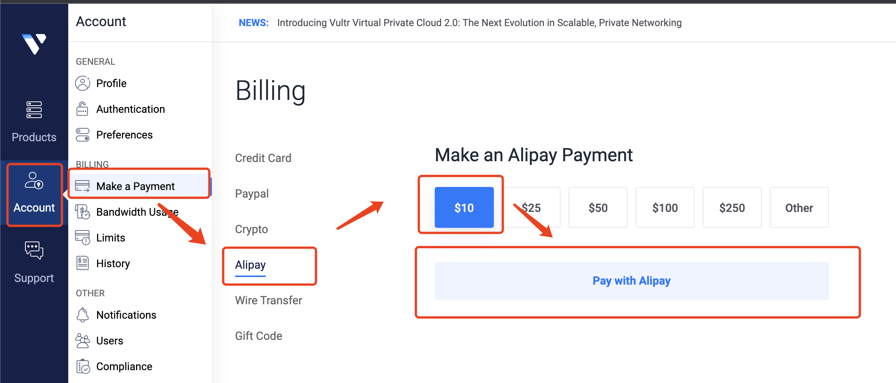

### 2. Deploying the Server

Step 1: On your account page, click **Products**, then click the **+** button on the right to add a server.

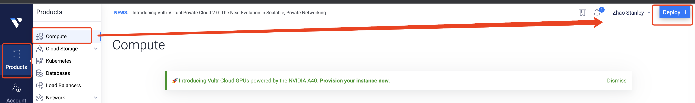

In the upper-right corner, select **Switch back to the old experience for a limited time** to return to the classic interface.

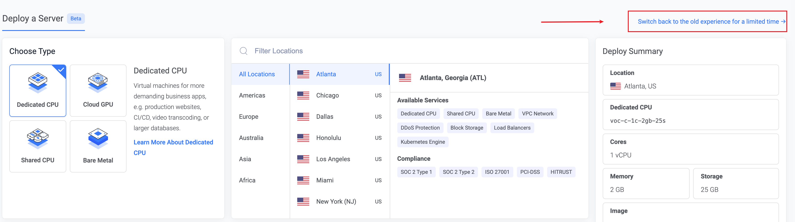

Select **Cloud Compute**.

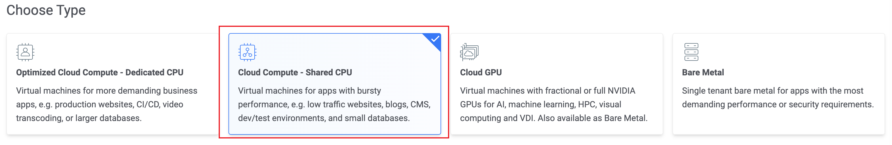

Step 2: Select Frankfurt, Germany. Many IP addresses assigned to Japanese servers have been blocked due to abuse, so consider choosing a European location such as France or Germany. You can choose another location if you prefer; the remaining steps are the same.

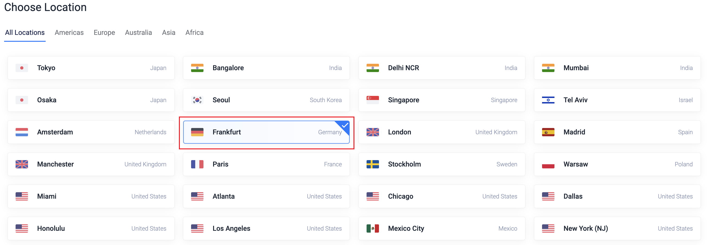

Step 3: For the operating system, select **Debian 12 x64** from the Debian drop-down menu.

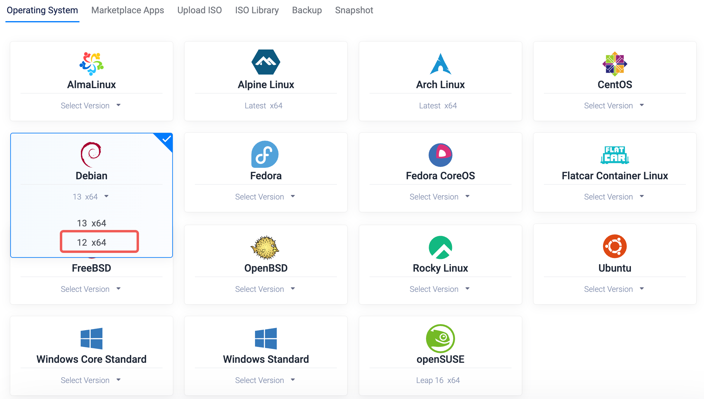

Step 4: Choose a plan. SS does not require a powerful server, so the entry-level $5-per-month plan is enough. The $2.50 plan always seems to be sold out, but grab it if it is available—you may not get another chance!

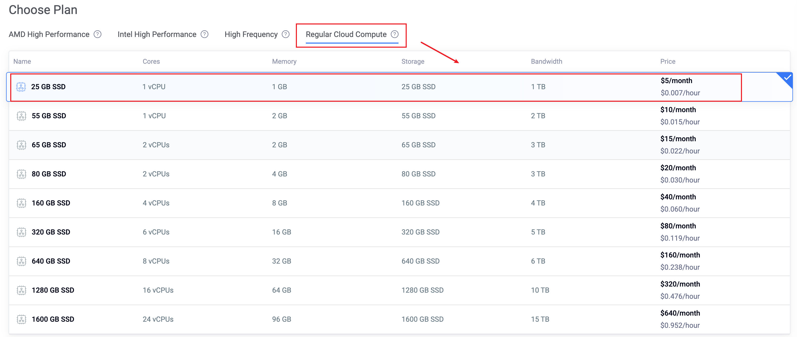

Remember to **disable automatic backups**, which cost an additional $1 per month.

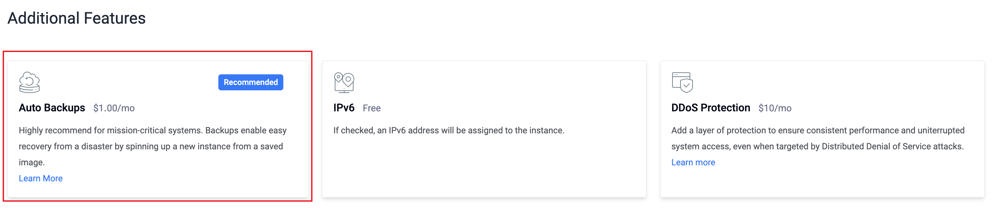

Step 5: Deploy the server. You can give it a name before deploying it if you like.

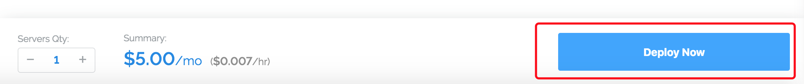

Step 6: Wait for the server to start. When its status turns green and displays **Running**, the server is ready. This usually takes 1–3 minutes.

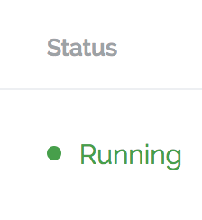

Step 7: Copy the IP address and password. You will need them later.

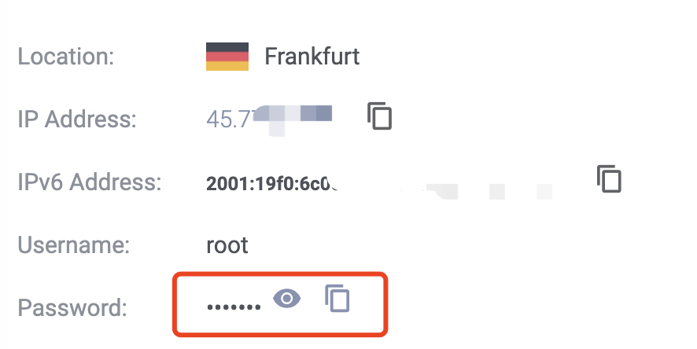

Step 8: Once the server is running, check whether its IP address is blocked. Open Command Prompt or a terminal and run `ping` followed by the server's IP address. For example, if the address is `8.8.8.8`, run `ping 8.8.8.8`. A response like the one below means that the IP address is reachable. An occasional `Request timed out` message only indicates packet loss, but if every request times out, delete the server and deploy a new one.

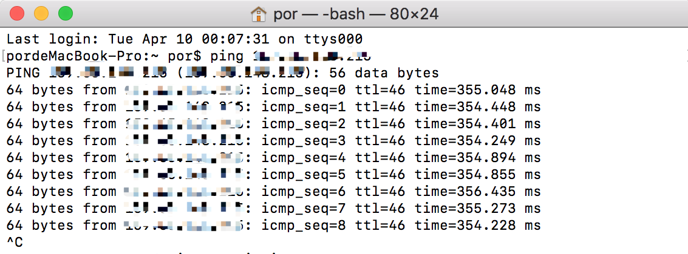

The hardest part is now behind you. The rest is almost a one-click process, so have a cup of tea 🍵 before continuing.

## Install SS on the Server

I normally use a Mac, but because most people use Windows, I brought out my old Windows 7 computer for the rest of this tutorial.

- **On a Mac, open Terminal and connect to your server with:**

```bash
ssh root@your_server_ip_address
```

**Once connected, skip the section on installing and running Xshell.**

- **On Windows 10, you can use the built-in PowerShell application:**

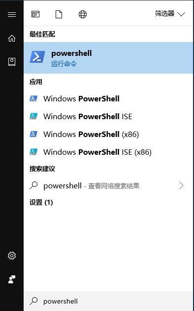

**Enter the following command:**

```bash
ssh root@your_server_ip_address
```

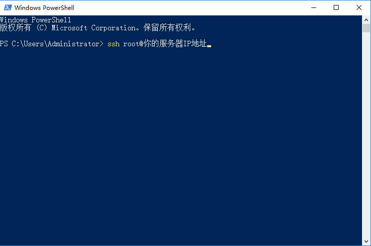

**Once connected, skip the section on installing and running Xshell.**

### Install and Run Xshell

**Note: If the server responds to ping but Xshell cannot connect, the server's SSH port may be blocked. This happens frequently with Vultr's Japanese servers. Try a server in another region or use a different provider.**

To connect over SSH from Windows, download Xshell; you can find it by searching Baidu. You may use another SSH client if you prefer, but this guide uses Xshell as an example. After installing it, select **File > New**.

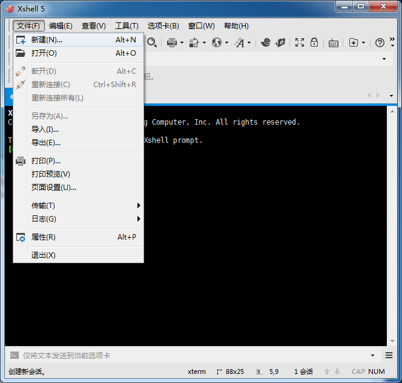

Configure the connection. Choose any name, enter your server's IP address in the **Host** field, and leave the remaining settings at their defaults.

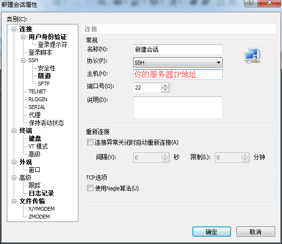

In the window that appears, enter `root`, the server's default username.

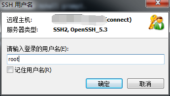

Enter the server password you copied earlier.

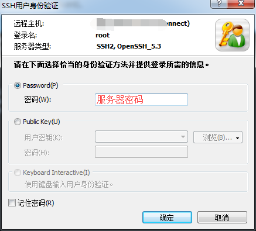

### Install SS

After you sign in successfully, the screen should look like this:

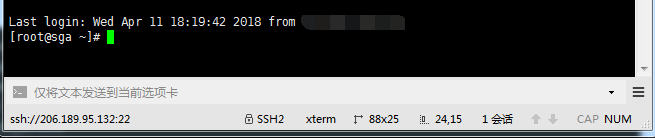

Now for the key step. Many thanks to [@teddysun](https://github.com/teddysun) for creating the one-click installation script. For more details, see https://teddysun.com/486.html. The commands below still work, but the original script is no longer maintained because [the author has retired](https://teddysun.com/548.html).

Thanks also to [@peinuanqin-nus](https://github.com/zhaoweih/Shadowsocks-Tutorial/issues/72#issuecomment-3017717903) for fixing the script.

```bash
wget --no-check-certificate -O shadowsocks-all.sh https://raw.githubusercontent.com/zhaoweih/Shadowsocks-Tutorial/main/sh/shadowsocks-all.sh
chmod +x shadowsocks-all.sh
./shadowsocks-all.sh 2>&1 | tee shadowsocks-all.log
```

Copy and paste the commands above into Xshell. In Xshell, right-click to paste. A large amount of output will appear before the script pauses at the following prompt:

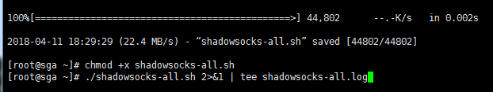

Press **Enter** to continue.

The script will ask which SS server implementation to install. This guide uses the libev version: enter **4** and press Enter.

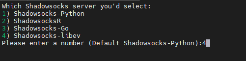

Next, enter the password that SS clients will use. This example uses **abc123456**.

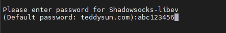

Enter a port number from 1 to 65535. This example uses **12853**.

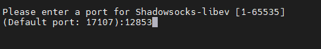

Choose an encryption method. I recommend **xchacha20-ietf-poly1305**, so enter **13**.

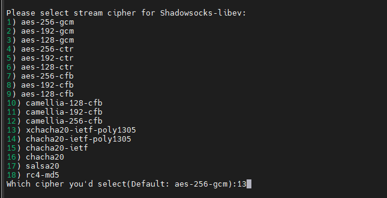

When asked whether to enable the simply-obfs plugin, accept the default by pressing Enter.

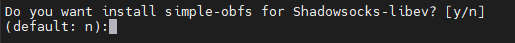

Press Enter again at the next prompt.

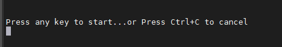

The installation may take a while. When it finishes, you will see a message like the one below. Cheers! 🍻

Take a screenshot so you do not lose these details: the server IP address, port, password, and encryption method.

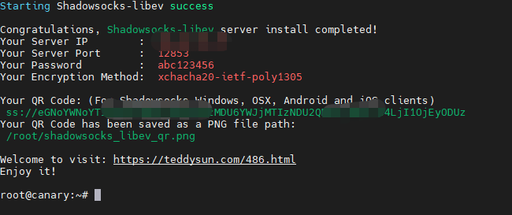

⚠️ Finally, disable the system firewall by pasting the following command and pressing Enter:

```bash
sudo ufw disable
```

## Download a Client

If you have followed the guide this far, the SS server is now installed. You will also need a client on your computer or mobile device. Download one for your platform below. I have used the Windows, macOS, Android, and iOS clients, and the setup process is similar on each platform.

Windows: https://github.com/shadowsocks/shadowsocks-windows/releases

Android: https://github.com/shadowsocks/shadowsocks-android/releases

macOS: https://github.com/shadowsocks/ShadowsocksX-NG/releases

Linux: https://github.com/shadowsocks/shadowsocks-qt5/wiki/Installation

iOS:

Because VPN apps—including apps that support SS—have been removed from the mainland China App Store, you will need an App Store account for another region.

I recommend creating a separate account for another region instead of changing the region of your mainland China account. You can then switch accounts depending on whether you need an app from the Chinese store or another region's store.

**If you do not want to go through the setup process, you can buy an App Store account for another region on Taobao. It is inexpensive, convenient, and quick.**

Steps:

1. Get an App Store account for a region outside mainland China.

Guide to registering an Apple ID for another region: https://www.zhihu.com/question/26458172

(Many other guides are available online.)

**Under Apple's policy, the `None` payment option may be unavailable unless your IP address matches the region in which you are registering. For example, registering a UK account may require a UK IP address. Use an IP address from the corresponding region during registration.**

2. Sign in to the App Store with the account for the other region.
3. Search for **Potatso Lite** in the App Store and install it.

Other apps that support Shadowsocks will also work, but I recommend Potatso Lite.

- [Potatso Lite](https://itunes.apple.com/us/app/potatso-lite/id1239860606?mt=8)


**The following example uses Windows:**

Open the Windows link above and download the client:

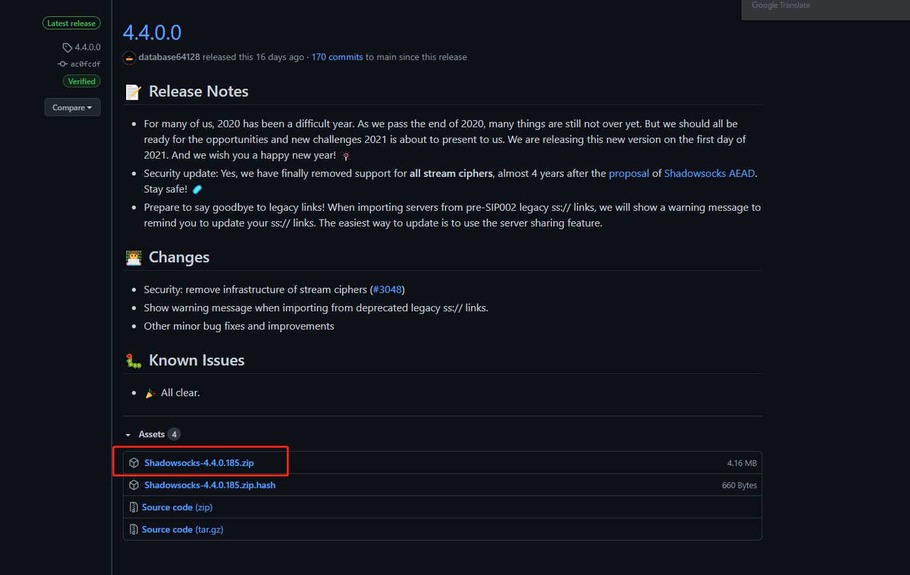

Extract the archive and run `Shadowsocks.exe`. Right-click the airplane icon in the system tray, then select **Servers > Edit Servers**:

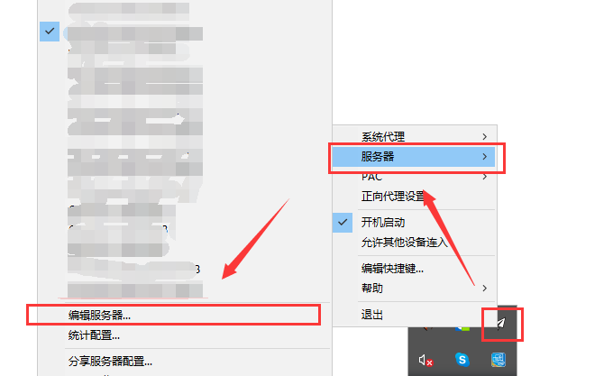

Use the information you saved earlier to enter the server IP address, port, password, and encryption method, then click **OK**.

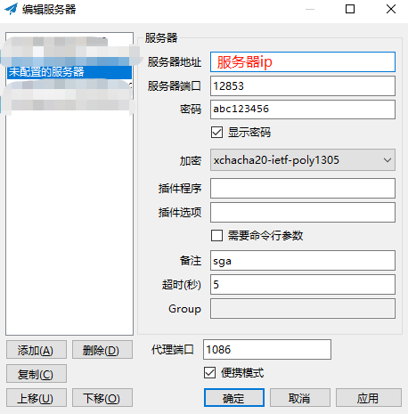

Finally, make sure PAC mode is enabled:

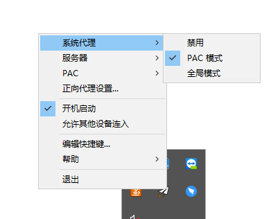

Here is a quick explanation of PAC and global modes:

In PAC mode, connections to Chinese websites go directly through your local network, while connections to blocked websites go through your server.

In global mode, all traffic goes through your server.

I recommend PAC mode. Its routing rules are maintained in [gfwlist](https://github.com/gfwlist/gfwlist).

If a website remains inaccessible in PAC mode, please report it to the gfwlist project.

### The Moment of Truth

Now for the moment of truth: enter `google.com` in your browser and press Enter. Voilà—Google is back!


# Additional Information

## Configure Multiple Ports

[How to Enable Multiple Ports in Shadowsocks](https://stanleyzhao.xyz/2019/06/01/%E5%A6%82%E4%BD%95%E5%90%AF%E7%94%A8Shadowsocks%E7%9A%84%E5%A4%9A%E7%AB%AF%E5%8F%A3/)

## Common Commands

`start` starts the service, `stop` stops it, `restart` restarts it, and `status` shows its current status.

### Shadowsocks-libev

```bash
/etc/init.d/shadowsocks-libev start
/etc/init.d/shadowsocks-libev stop
/etc/init.d/shadowsocks-libev restart
/etc/init.d/shadowsocks-libev status
```

### Shadowsocks-Python

```bash
/etc/init.d/shadowsocks-python start
/etc/init.d/shadowsocks-python stop
/etc/init.d/shadowsocks-python restart
/etc/init.d/shadowsocks-python status
```

### ShadowsocksR

```bash
/etc/init.d/shadowsocks-r start
/etc/init.d/shadowsocks-r stop
/etc/init.d/shadowsocks-r restart
/etc/init.d/shadowsocks-r status
```

### Shadowsocks-Go

```bash
/etc/init.d/shadowsocks-go start
/etc/init.d/shadowsocks-go stop
/etc/init.d/shadowsocks-go restart
/etc/init.d/shadowsocks-go status
```

## How to Uninstall

Run the following command, then select the version you want to uninstall when prompted:

```bash
./shadowsocks-all.sh uninstall
```

# Finally

The basic setup is now complete. If you want to improve the server connection, you can also enable BBR. See [this article](https://teddysun.com/489.html) for details.

> Sign in as `root` and run the following command:
>
> ```bash
> wget --no-check-certificate https://github.com/teddysun/across/raw/master/bbr.sh && chmod +x bbr.sh && ./bbr.sh
> ```
>
> When the installation finishes, the script will prompt you to restart the VPS. Enter `y` and press Enter.

# Q&A

Here are answers to some questions I have received by email.

**[Resolved] 1. Problem: `-bash: wget: command not found`**

Environment: Linode server in Singapore running CentOS 7.

Follow this article to install `wget`, then try again: https://www.wn789.com/5624.html

**[Resolved] 2. Google Scholar reports: "We are sorry, but your computer or network may be sending automated queries. To protect our users, we can't process your request right now."**

Google uses anti-proxy and anti-bot systems, so it may identify many VPS IP addresses as proxies. If this happens, switch to another server. If you do not have another server available, you can use a **Google Scholar mirror**.

**[Resolved] 3. `[Error] Failed to install python`**

The install script listed the Python 2 package names (`python`, `python-dev`, `python-setuptools`) as dependencies, but those packages were **removed in Debian 11 and Ubuntu 20.04**. apt cannot find them and aborts, so the install stops there even when you picked the libev version.

This is now fixed: the script detects whether Python 2 exists and falls back to the `python3` packages otherwise. Re-download the script if you are running an older copy. See [#27](https://github.com/zhaoweih/Shadowsocks-Tutorial/issues/27).

**[Resolved] 4. The server responds to ping, but the client cannot connect**

The firewall may still be enabled. Vultr enables it by default, so disable it to allow connections to the port:

```bash
sudo ufw disable
```

After running the command, use `ufw status` to check the firewall status. An `inactive` status means the firewall is disabled.

(`systemctl status firewalld` only applies to CentOS and other firewalld-based systems; on Debian/Ubuntu it reports `Unit firewalld.service could not be found`.)

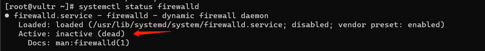

[Check online whether a port is open](https://tool.chinaz.com/port)

# Discussion

## Discord

**I created a Discord server where you can ask questions and discuss the tutorial with others.**

[](https://discord.gg/wHFxCVk)

# More

To learn more about Shadowsocks and how VPNs, VPSs, and proxies relate to one another, read the following article:

- [A Brief Introduction to the Relationship and Differences between VPN, VPS, Proxy, and Shadowsocks](https://medium.com/@thomas_summon/%E6%B5%85%E8%B0%88vpn-vps-proxy%E4%BB%A5%E5%8F%8Ashadowsocks%E4%B9%8B%E9%97%B4%E7%9A%84%E8%81%94%E7%B3%BB%E5%92%8C%E5%8C%BA%E5%88%AB-b0198f92db1b)

# Suggestions

If you have any questions about this guide, open an [issue](https://github.com/zhaoweih/Shadowsocks-Tutorial/issues). If you know a simpler or alternative approach, feel free to submit a pull request.

# About

I am new to working life—a young office worker in pursuit of freedom. If you would like to get in touch, send me an email. 📧

📮 My email: [zhaoweihao.dev@gmail.com](mailto:zhaoweihao.dev@gmail.com)

# Donations

I have everything I need, so there is no need to donate. If you found this guide helpful, give the repository a star or fork it. ❤️ Thank you!
