[🌏English Version](./README_en.md)

[🇨🇳中文版本](./README.md)

>注意：本文章由ChatGPT翻譯，由我本人審核。對於任何語義不正確之處，我們深感抱歉。
>本文已優化並調整，以適應中國網絡環境。部分內容可能對中國以外的讀者不相關。

**[完整文章目錄](https://github.com/zhaoweih/Shadowsocks-Tutorial/wiki/%E7%9B%AE%E5%BD%95)**

>🚀 安裝成功後，如果想要加速 Shadowsocks，您可以參考我的文章[給初學者的kcptun加速 Shadowsocks 教程](./kcptun_shadowsocks_tutorial.md) （效果非常明顯）。
>
> 如果在過程中遇到無法解決的問題，您可以發送郵件到我的郵箱 zhaoweihao.dev@gmail.com或者[提出問題](https://github.com/zhaoweih/Shadowsocks-Tutorial/issues)
>
> 如果工程師朋友們需要加速Git克隆速度，您可以查看這篇文章[給初學者的Git配置Shadowsocks 代理加速教程](./git/git_shadowsocks_readme.md)


# 前言 

为什么要做这个库？因为有句话说"不會翻牆的程序員不是好程序員"，但是某些原因，翻牆可是越來越難了，我之前是用某燈，但是自從上個月開始某燈也不穩定了；我還以為可以和某燈相宿相飛一段時間的，後來就投靠了Shadowsocks了，為什麼會選擇Shadowsocks呢，因為可以自己搭建伺服器，不再受牽制，而且由於是個人伺服器被封IP的機會也不會很大；當然你也可以和自己信任的人共享使用，但是Shadowsocks的教程網絡上真是參次不齊，很容易誤導那些只想翻牆而不是要了解它原理的人，所以我就蹦出個想法：做個幾乎是一鍵式的傻瓜Shadowsocks（以下簡稱ss）搭建教程給小白們，讓大家都能共享自由的互聯網。


# 開始 

## 購買VPS伺服器 

俗話說，萬事起頭難。想想倒也是這樣，也不是說購買VPS伺服器有多難，是接受它比較難，我當時也是一個還沒買過伺服器的小白，對於第一次嘗試的東西都沒有底，怎麼敢隨意下手。好了，你現在可以放心了，據我使用，Vultr和DigitalOcean這兩個服務商都是可以隨時部署隨時摧毀伺服器，是按每小時計費的，一個月是5美金，大概0.007美金一小時，就算你創建一個伺服器IP剛好被某牆屏蔽了，那就刪掉也只是扣0.1美金，作為一個窮學生的我都能接受了，你還猶豫嗎？

### 1、註冊並登錄

[](https://www.vultr.com/?ref=9091308-8H)

Vultr推薦連結：https://www.vultr.com/?ref=7370522

這裡我比較推薦 Vultr，為什麼呢？因為他有日本伺服器，延遲低，掉包也低； 註冊登錄後先充值5美金，可以選擇信用卡，也可以選擇支付寶（Alipay）。


### 2、部署伺服器

第一步：在個人頁面點擊「Products」，然後再點右邊的➕號按鈕添加一個伺服器

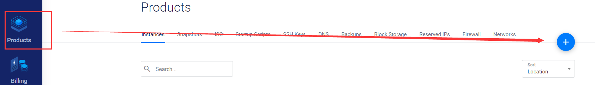

選擇**Cloud Compute**

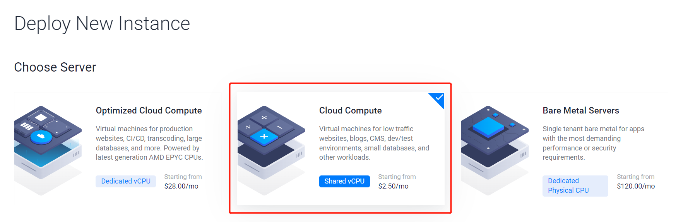

選擇**Regular Performance**

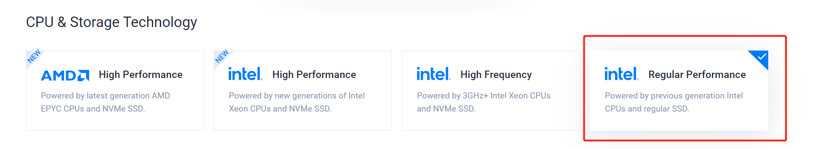

第二步：在打開的頁面選擇德國Frankfurt伺服器（由於日本伺服器濫用導致很多IP在内地被封了，可以選擇歐洲伺服器，例如法國、德國等），如果喜歡其他伺服器也可以選擇，後續操作是一樣一樣的

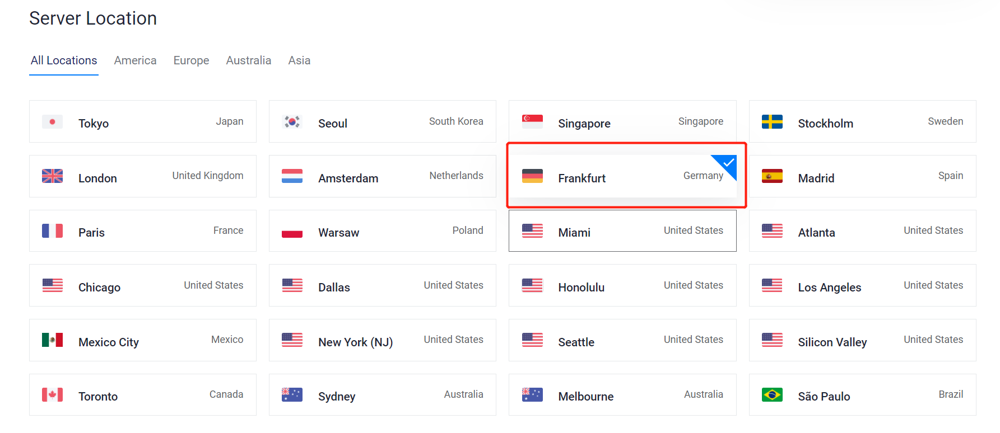

第三步：接下來要注意了，系統最好選擇 **CentOS 7 x64**，點擊CentOS可以下拉選擇7 x64

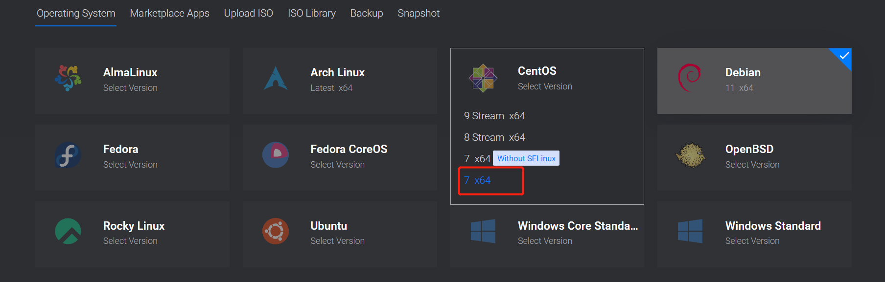

第四步：選擇套餐，當然ss不需要配置太高的伺服器，最低配置5美金一個月的就可以了，反正我每次看2.5美金都是賣光的，如果你能看到那趕緊選啊，千年一遇。

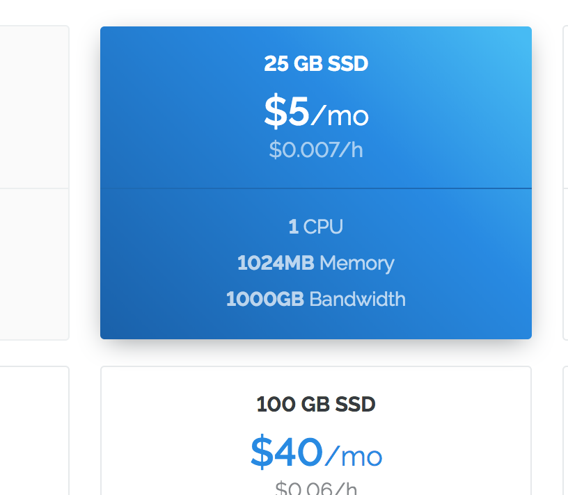

記得 **取消選中自動備份**（會收1美金/月）

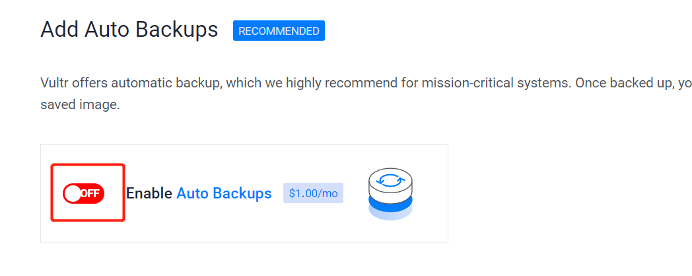

第五步：接著就是部署起來了，當然你也可以給伺服器起個名字再部署

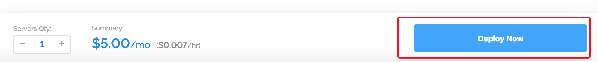

第六步：接著等待伺服器啟動完成，看到Status是綠色的Running就是啟動完成了，這個過程大概需要1-3分鐘。

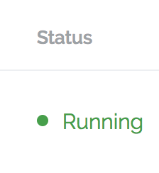

第七步：複製IP地址和密碼，後面有用

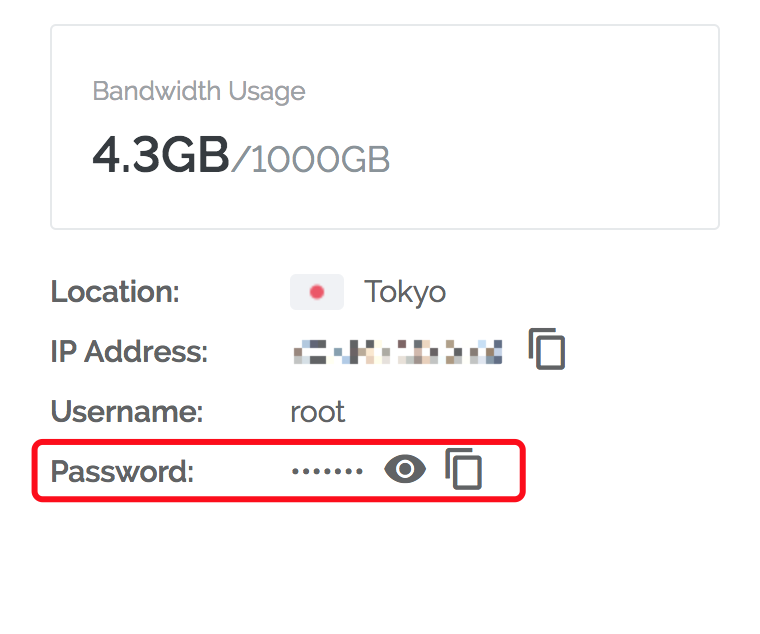

好了，到此為止最困難的事情已經過去了，後面都是一鍵式的了，喝杯茶🍵再繼續。

## 在伺服器安裝ss

因為我是用mac的，考慮到大多數人還是使用windows為主，我就把我的舊電腦給翻出來開機繼續做教程。基於windows 7。

- **如果你是用mac，那恭喜你，下面連接的步驟直接打開終端輸入**

`ssh root@你的伺服器IP地址`

**連接就可以，然後可以跳過安裝並運行xshell這個步驟**


- **如果你是用windows 10，可以打開系統自帶的powershell工具:**


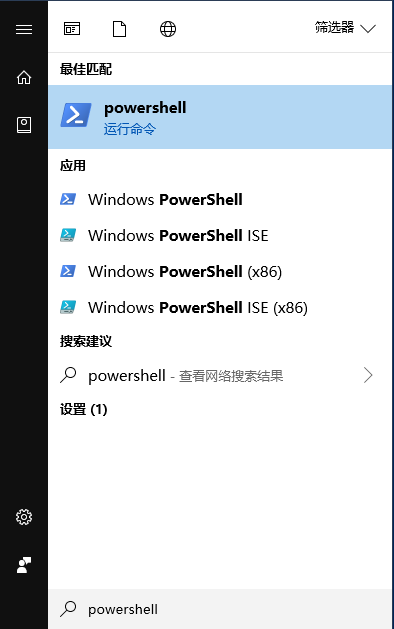

**輸入**

`ssh root@你的伺服器IP地址`

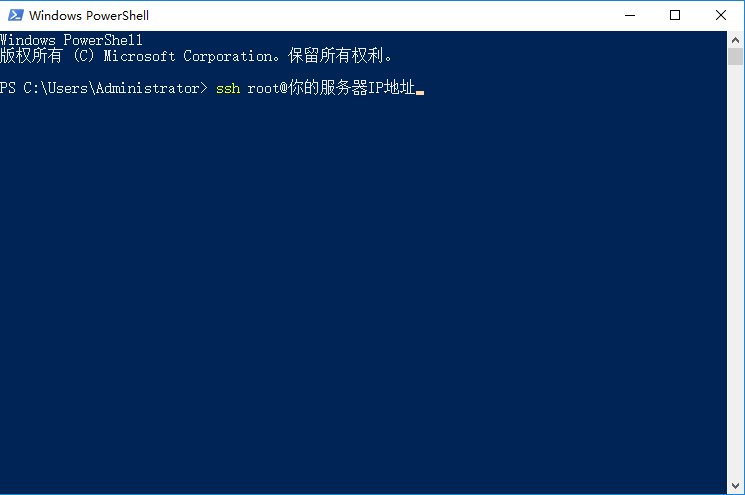

**連接就可以，然後可以跳過安裝並運行xshell這個步驟**

### 安裝並運行xshell

Windows下ssh連接需要下載Xshell，Google搜一搜就能下載了，當然你也可以用其他的，這裡以Xshell為例，安裝好Xshell後點擊文件-新建

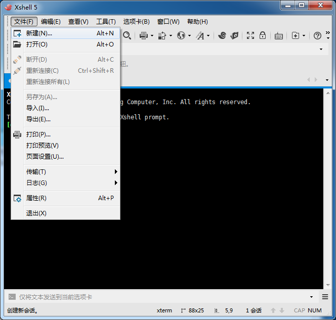

接下來配置連接，名稱隨便起，主機填寫你的伺服器IP地址，下面都默認就好

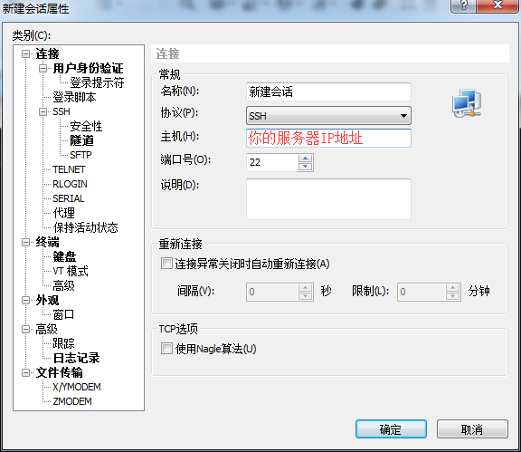

接下來在彈出的視窗填root（默認伺服器用戶名）

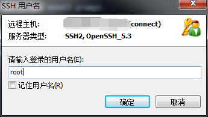

這裡就要填入你在上篇複製的伺服器密碼了

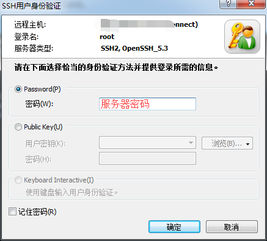

### 安裝ss

上面登錄成功後如圖所示


下面就是精髓的部分了，感謝[@teddysun](https://github.com/teddysun)巴打制作的一鍵安裝腳本，具體更多細節可查看博客：https://teddysun.com/486.html (由於巴打的[退出](https://teddysun.com/548.html)，所以下面的Command目前還可以使用，但是版本已經不再更新)

```bash
wget --no-check-certificate -O shadowsocks-all.sh https://raw.githubusercontent.com/teddysun/shadowsocks_install/master/shadowsocks-all.sh
chmod +x shadowsocks-all.sh
./shadowsocks-all.sh 2>&1 | tee shadowsocks-all.log
```

複製粘貼上面代碼到xshell，在xshell要右鍵粘貼，然後就會有一大串不知名Code蹦出，停在這裡了

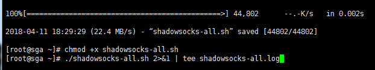

這時候按一下**Enter回車鍵**它又可以繼續了～

接著又蹦出些東西，是讓我們選擇ss的伺服器端，這裡我選擇libev版本的，輸入**4**按Enter

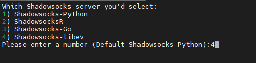

如同往常，接下來是要填入ss客戶端登錄的密碼，這裡我隨意填：**abc123456**

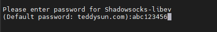

接下來是輸入端口號（1-65535任意數字），這裡我隨便填個**12853**的

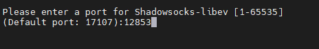

接下來是選擇加密方式，最好選擇xchacha20-ietf-poly1305，輸入**13**

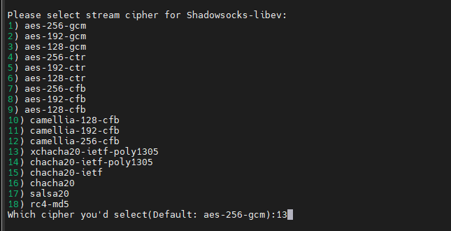

接著是否需要開啟simply-obfs插件，默認就行，**回車**


接著又是反手一個**回車**就好

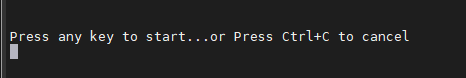

這裡可能需要等待一會，看到下圖就是大功告成了。乾杯🍻！

這個最好截圖一下，以防忘記了。

我就當大家英文水平還好吧，下面說的就是你的伺服器IP，伺服器端端口，密碼，加密方式。

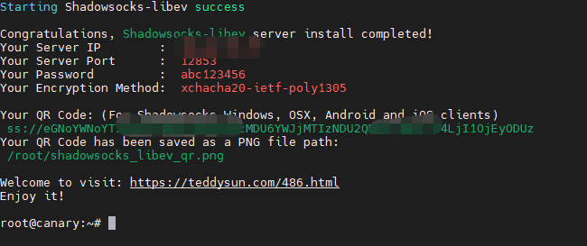

最後需要關閉下系統的防火牆，粘貼下面的命令然後回車就行

```bash
systemctl stop firewalld
systemctl disable firewalld
```

## 下載客戶端

如果你跟著我到了這一步就代表安裝好了伺服器端，但是我們的電腦手機作為客戶端也是需要安裝客戶端軟體的。下面是各個終端的下載地址（我用過Windows,MAC,Android,IOS操作起來都是差不多的。）：

Windows：https://github.com/shadowsocks/shadowsocks-windows/releases

Android:https://github.com/shadowsocks/shadowsocks-android/releases

MAC:https://github.com/shadowsocks/ShadowsocksX-NG/releases

Linux:https://github.com/shadowsocks/shadowsocks-qt5/wiki/Installation


IOS: 

1.在AppStore中切換為中國區以外帳號

2.在AppStore搜索**Potatso Lite**安裝，付費的可以搜索**Shadowrocket**

- [Potatso Lite](https://itunes.apple.com/us/app/potatso-lite/id1239860606?mt=8)
- [Shadowrocket](https://apps.apple.com/ca/app/shadowrocket/id932747118)
  

**下面以Windows為例演示：**

打開上方網址下載客戶端：

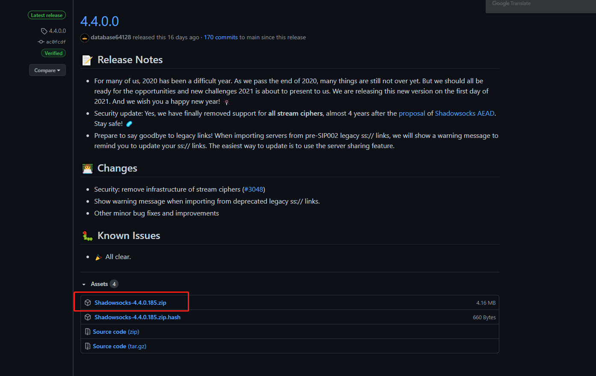

接著解壓後打開Shadowsocks.exe，右擊右下角小飛機，點擊伺服器-編輯伺服器：

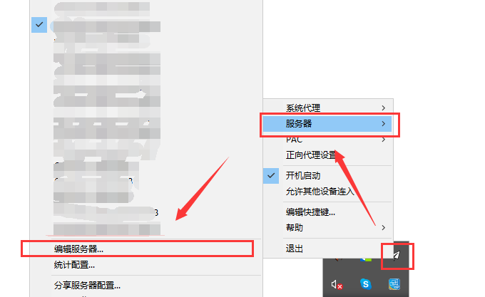

還記得上面建議保存的圖片嗎？這裡就用到了，伺服器IP，端口，密碼，加密方式，然後點擊確定

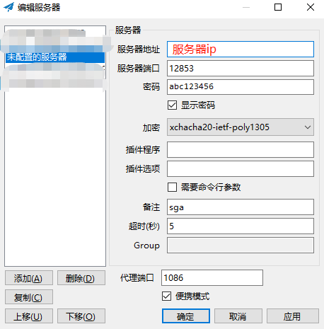

最後確保打開了PAC模式：

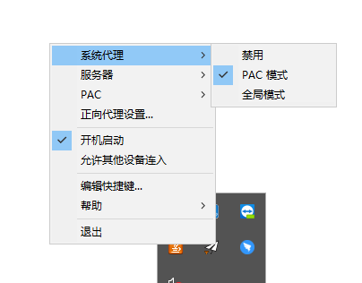

- 這裡簡要說一下PAC模式和全局模式問題：
- PAC模式就是訪問內地網站會走內地IP，訪問被封的網站走伺服器IP

全局就是全部走伺服器IP

這裡建議選擇PAC模式，PAC的地址都是保存在[gfwlist](https://github.com/gfwlist/gfwlist)

希望大家遇到PAC無法訪問的網站多上去提issues。

### 神聖時刻

接著最神聖的時刻來了，在瀏覽器打開[whoer](https://whoer.net/)，回車，蹦，IP在其他國家了


# 建議

如果大家對這篇文章有任何疑問都可以提[issues](https://github.com/zhaoweih/Shadowsocks-Tutorial/issues)，如果你有其他更簡單或者其他方法翻牆也可以pull requests。

# 關於

我是一名初入社會的社畜，一個追求自由的少年，如果想要找我，可以給我發郵件📧

📮我的郵箱：zhaoweihao.dev@gmail.com
