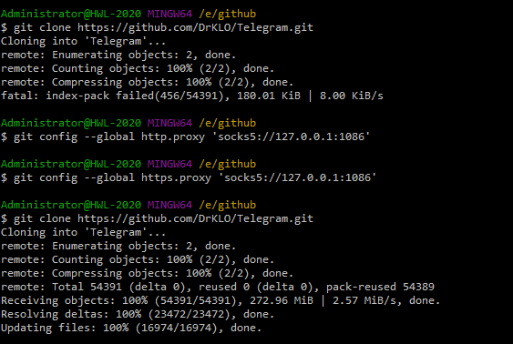
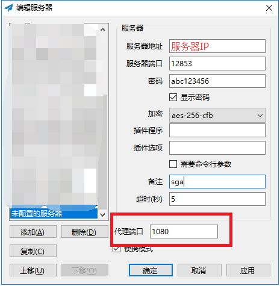

# 给小白的git配置shadowsocks代理加速教程

先看看加速的效果:



以拉取telegram仓库为例，加速前使用电信直连大概在**8KB/s**左右，拉完项目不知道何年何月了，下面是加速后的效果，大概是**2.57MB/s**左右(这个跟你的代理服务器有关,我的代理服务器是30Mbps的)，clone个仓库喝口茶的时间都不用。


好了，看了效果就来看如何配置，其实很简单，就两行命令(前提是你已经有shadowsocks并且可用)

#### **1.首先查看本地shadowsocks端口**

先查看shadowsocks本地socks端口，**windows一般是1080,mac是1086**

以windows为例，右键shadowsocks小飞机图标找到**编辑服务器**就能看到



#### 2.设置git全局代理端口

以windows为例，在命令行输入(mac将后面的端口改成**1086**就可以):

```
git config --global http.proxy 'socks5://127.0.0.1:1080'
git config --global https.proxy 'socks5://127.0.0.1:1080'
```

#### 3.完成

再git clone一次看看😀


#### 联系我:

zhaoweihao.dev@gmail.com