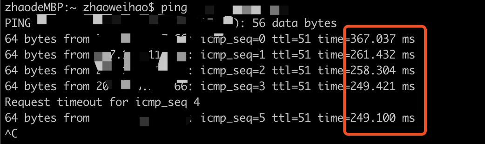
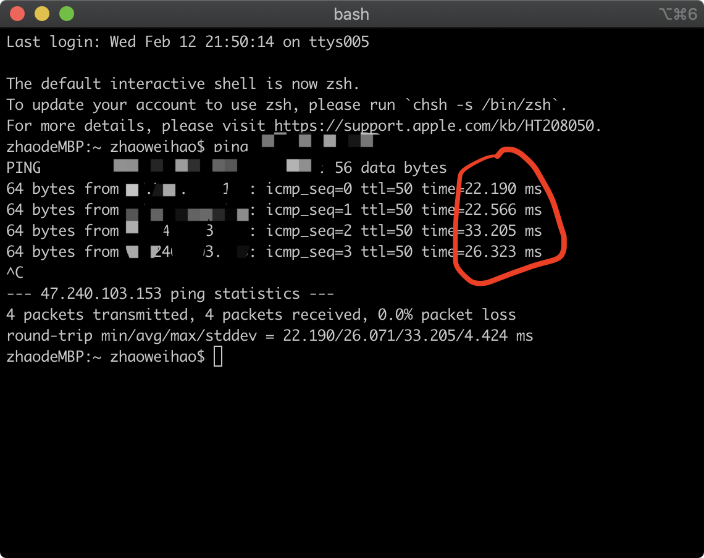
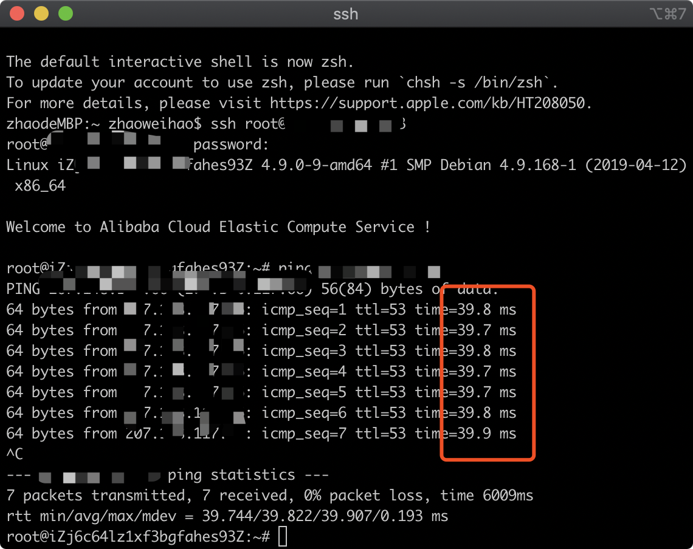
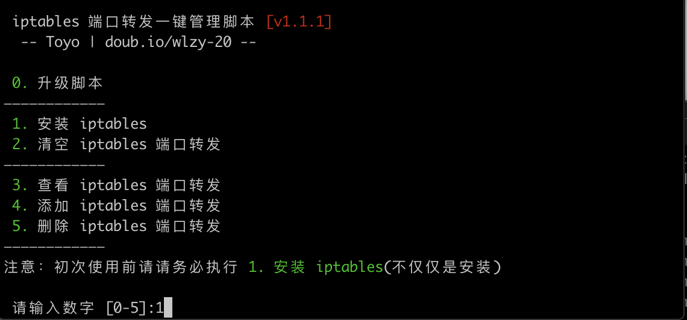
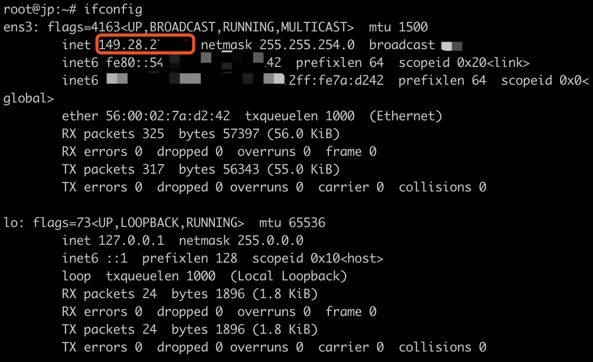
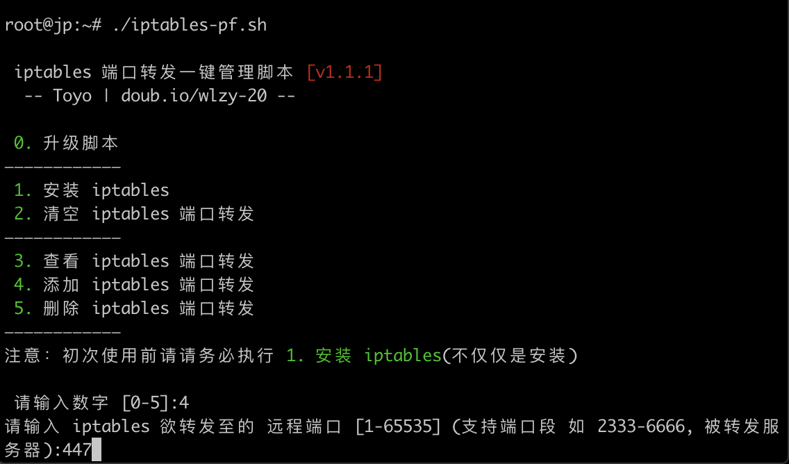
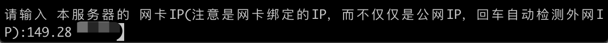
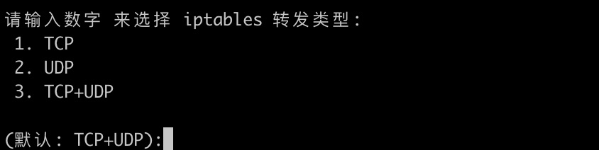

# 前言

  ”世界加钱可及“这句话说的真没错，这片文章是给追求速度而且土豪的大家，一般的shadowscocks搭建就是买个国外服务器然后使用脚本搭建起来，然后这时候你的连接方式是直连的，例如你买的是新加坡的服务器，你的连接路径是你家->新加坡（这里不涉及绕道那些），然后你ping一下新加坡的服务器，如下：



由于不可抗因素，平均在260多毫秒左右，还不算上丢包，上个谷歌都慢，更别说看视频，这时候大伙会说我可以去买个更好一点的服务器，但是这个治标不治本的，再怎么好的服务器还不如来个国内中转快，什么是国内中转呢？国内中转的意思就是你买多个国内的服务器（例如阿里云），然后将路径改成你家->国内阿里云->新加坡，这时候你会问这不是绕远了吗，但是服务器国际带宽肯定比家宽大而且快，所以这样一来反而会更快，但是更烧钱了。

例如我有个阿里云香港的服务器（买不起国内的），因为阿里云不让我搭shadowsocks所以我拿来中转流量，现在我的路径是 家里->阿里云香港->Vultr新加坡

我家->阿里云香港 大约25毫秒左右



阿里云香港->新加坡 大约39毫秒左右



这样不算其他时间，我中转后合起来大概65毫秒左右，比直连的260毫秒快多了，而且也稳定多了。


# 教程

  其实中转流量的操作很简单的，只是比较烧钱而且，下面来进入教程。

## 1、准备需要被中转的服务器（就是你的国外服务器）， 中转的服务器（你的国内服务器）

首先得在你的国外服务器搭建好shadowsocks，具体怎么搭就不说了，可以看我另外一篇[文章](./README.md)。

例如我搭建好shadowsocks的的国外服务器ip为 1.1.1.1，端口为447

我的国内服务器ip为8.8.8.8

## 2、 在国内服务器配置好iptables

用ssh连接上国内服务器，复制粘贴下面的代码到服务器，回车运行（感谢逗比制作的一键脚本:https://doubibackup.com/mbofzp9h-2.html）

```bash
wget -N --no-check-certificate https://raw.githubusercontent.com/ToyoDAdoubiBackup/doubi/master/iptables-pf.sh && chmod +x iptables-pf.sh && bash iptables-pf.sh
```

然后输入`1`安装iptables,然后回车



然后输入 

```
ifconfig
```

回车查看本地ip，复制后面有用，例如我的本地ip为6.6.6.6




紧接着输入

```bash
./iptables-pf.sh
```

回车运行脚本

选择`4`添加iptables端口转发

欲转发的远程填入447，跟你配置的shadowsocks端口一致就可以



远程ip填入你的国外服务器ip，例如我的是1.1.1.1


紧接着也是填写端口，填入447即可


最后填入本地ip，还记得之前保存的本地ip吗，粘贴进去，例如我的是6.6.6.6



选择iptables转发类型默认就行，回车



最后回车就可以完成配置了

## 3、修改ip

最后在shadowsocks客户端把国外的ip改成你的国内ip就可以了，体验丝般顺滑吧！


# 最后

如果觉得文章对你有作用，可以给我star✨，谢谢！


# 联系

📮Email:zhaoweihao.dev@gmail.com

📰Telegram:https://t.me/zhao_weihao