# 前言
  我之前发过一个利用国内VPS做中转加速的文章，虽然加速明显，但是需要买多个服务器花多一分钱，对于荷包不太友好。这一次的教程是在原有的shadowsocks(以下简称ss)服务器上做加速，省下买多一个服务器的钱，而且加速效果也非常好，我一个在vultr的服务器原本在晚上是youtube打开都成问题的，只是能连接上，但是慢成狗，用这个方法加速后晚上也可以打开youtube看个1080p没问题了，好了，废话少说直接上教程。

# 前期准备
  由于我这个教程主要是讲的是怎么利用kcptun加速ss，所以我这里已经假设你已经买了服务器并搭好了一个能用的ss了，如果你还没有搭建好ss的话，可以去看我的这个文章[给小白的Shadowsocks翻墙教程](./README.md)，例如我已经搭好了一个服务器，具体配置如下 服务器IP为8.8.8.8 端口为447
  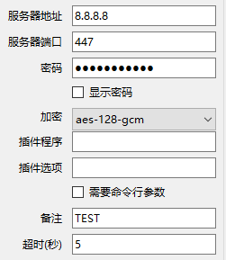

# 安装kcptun服务器端

## ssh登录服务器

**注意：我的教程环境是服务器是debian 10系统，如果出现不可解决的问题可以尝试用跟我一样的环境**

  如果你是已经搭建好了ss了，那也应该知道怎么用ssh登录服务器了，用什么ssh工具都行的，我这里用的是putty做示范
  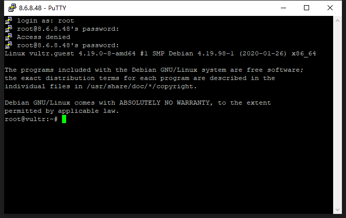

登录后复制下面命令并粘贴到服务器回车执行

```bash
wget --no-check-certificate https://github.com/kuoruan/shell-scripts/raw/master/kcptun/kcptun.sh
chmod +x ./kcptun.sh
./kcptun.sh
```


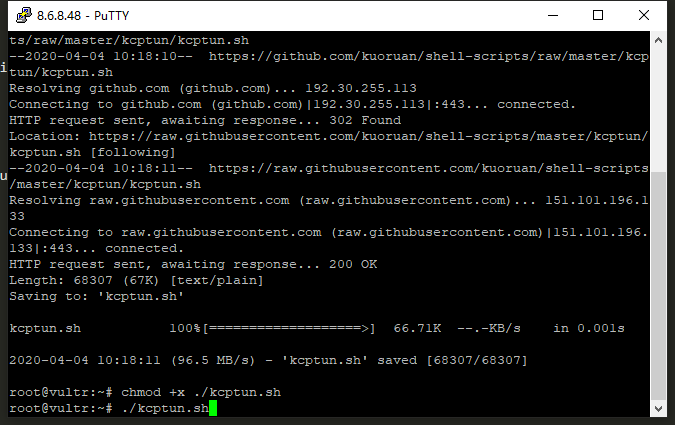

首先需要输入kcptun服务端端口，这里有个默认的29900，最好不要用默认的，写个自己喜欢的端口[1~65535]，例如我填10234， 回车

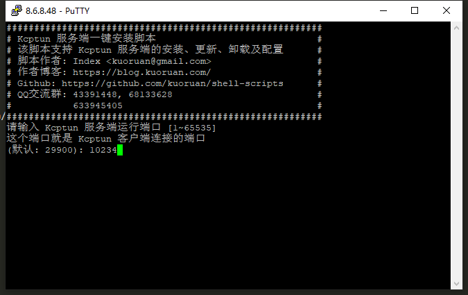

接着需要输入ip，默认就行，回车

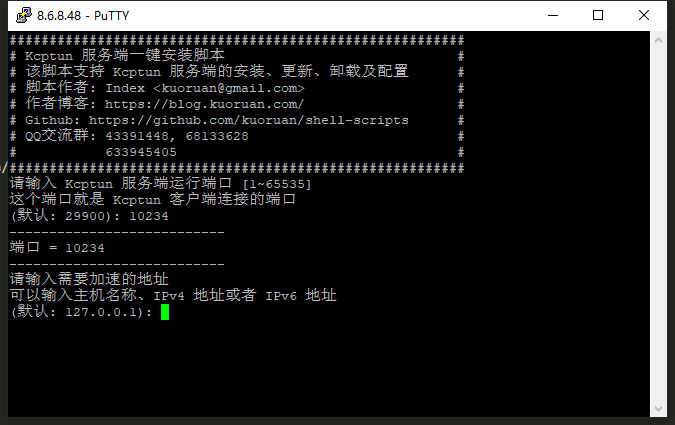

接下来需要填入你需要加速的端口，这里要填你的**ss端口**，例如我的是447， 回车

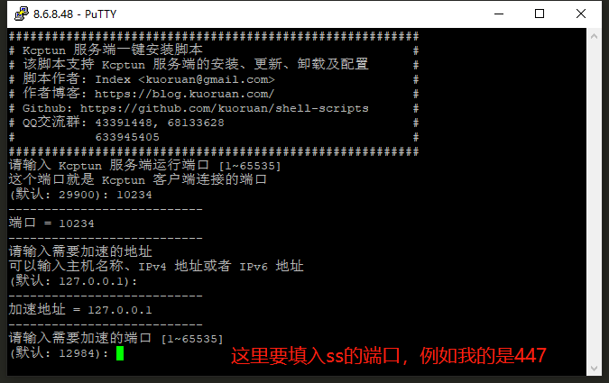

设置kcptun的密码，例如我的是abc123456， 回车

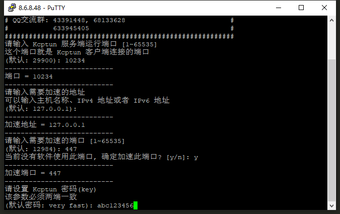

接下来配置加密方式，这个选择aes或者不加密就行，这里我选择默认的aes，直接回车就行

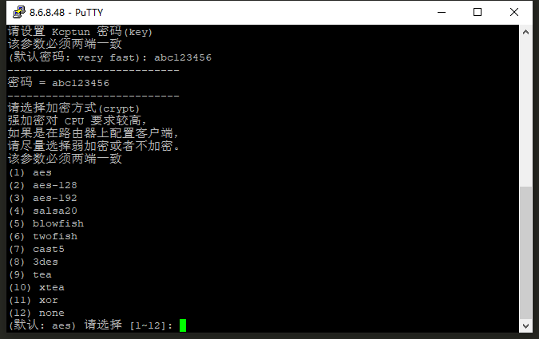

接下来的都选择默认就行，回车，***注意*：到是否关闭数据压缩这一步需要停一下，输入y回车关闭数据压缩**

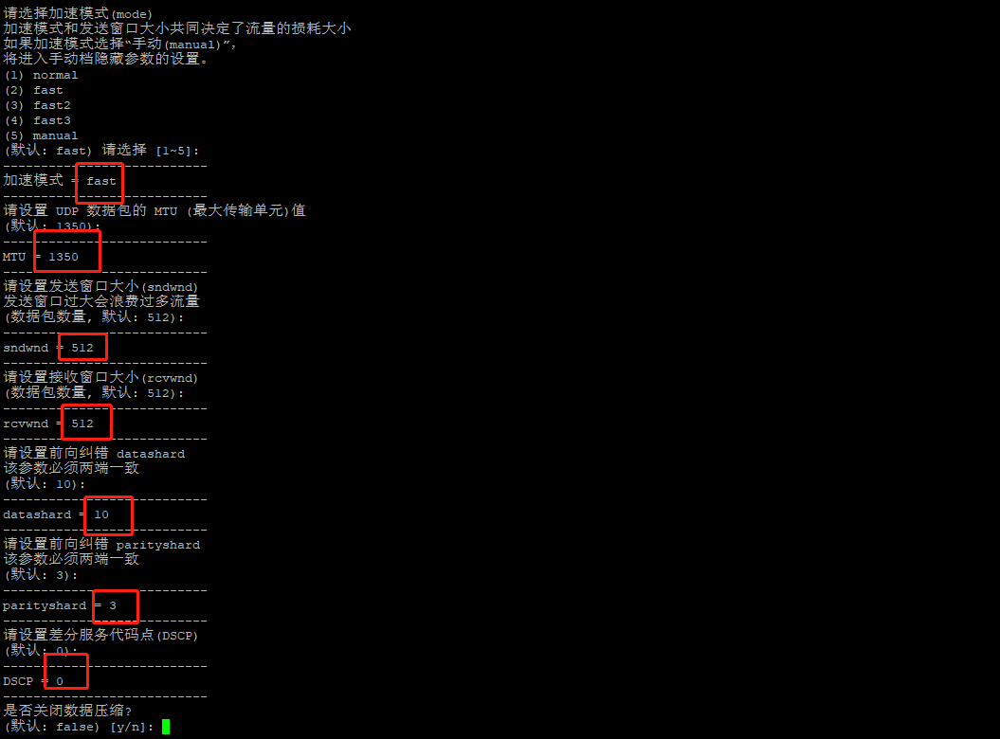

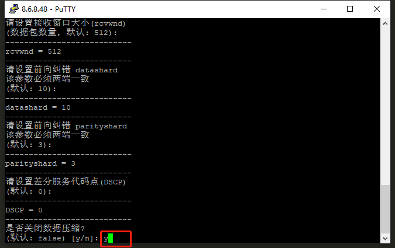

后面的都是选择默认就行，直接回车，到最后也直接回车继续安装就行

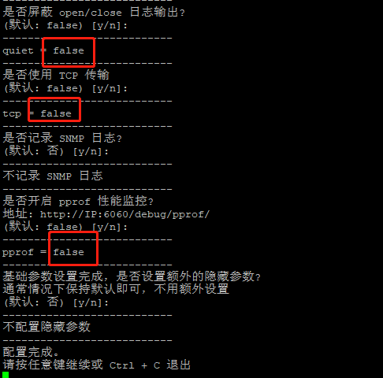

安装过程可能需要花点时间，这时候砌杯茶🍵等一下就行，完成安装后会显示下面的界面，**记得将手机端参数复制保存下来，后面会需要用到**

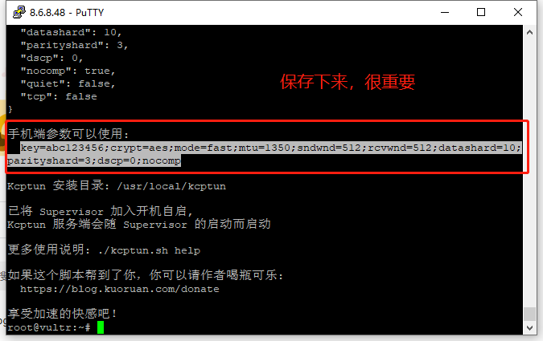

到此为止kcptun服务端就配置好了，先把茶喝完休息一下进行下面的步骤

# 配置kcptun客户端

## 以Windows为例

如果上面的步骤你都正确配置了，就代表你的kcptun就配置好了，接下来是配置客户端软件

首先到这里https://github.com/shadowsocks/kcptun/releases

下载你的客户端软件，例如我是windows 64位的，我需要下载kcptun-windows-amd64-20170718.tar.gz这个文件

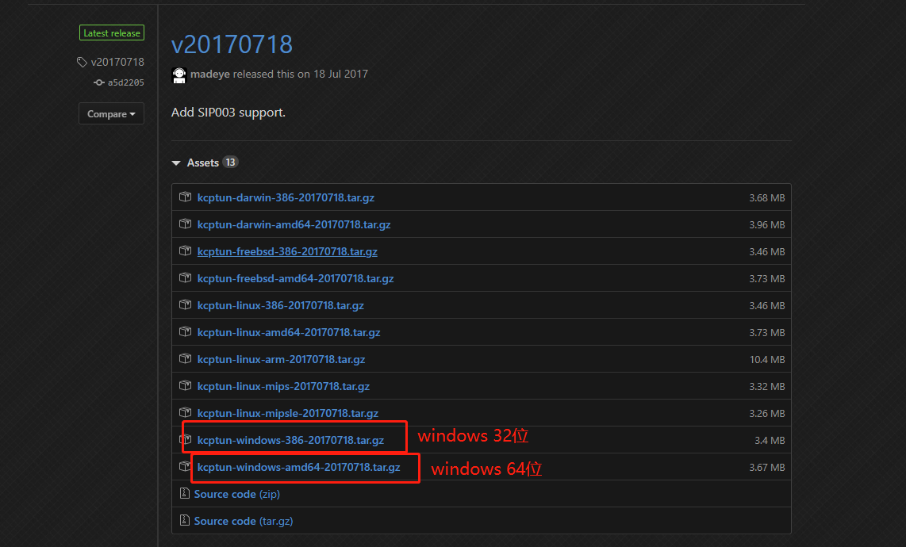

下载后解压后将client_windows_amd64.exe复制一个重命名为kcptun.exe

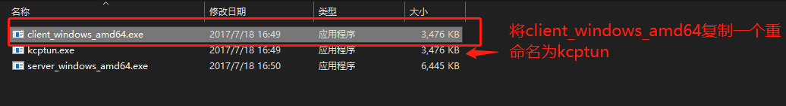

将kcptun.exe复制到shadowsocks.exe同级目录下

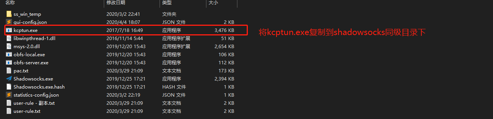

接下来修改shadowsocks配置

**1 修改为kcptun端口，注：不是你的ss端口哦**

**2 修改成kcptun**

**3 粘贴之前复制的手机端参数进去**

然后确定，重新启动一下ss应该就能体会加速后的效果了

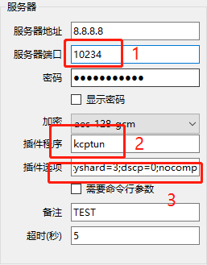


## 其他客户端

**MAC:Mac shadowsocks客户端是自带kcptun插件的，只要填入kcptun 跟将手机端参数填上就行**

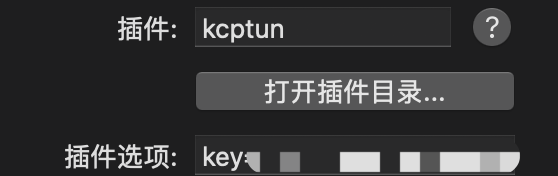

**Android:需要先在google play搜索 kcptun安装上，然后选择kcptun插件跟填入手机端参数就行**

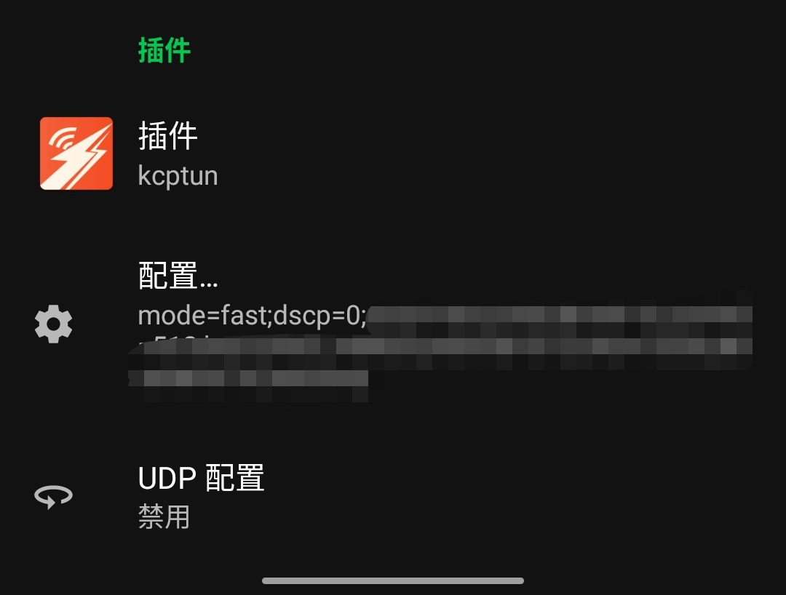

# 注意

1、使用kcptun会消耗比平常高几倍的流量，如果用的是固网那没有关系，如果是用的手机流量就要留意下流量的


# 联系

邮箱：zhaoweihao.dev@gmail.com