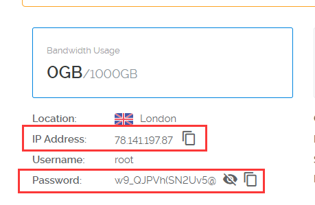
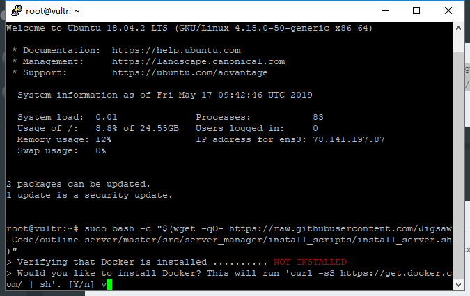
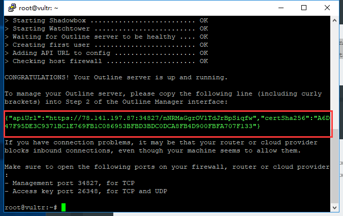
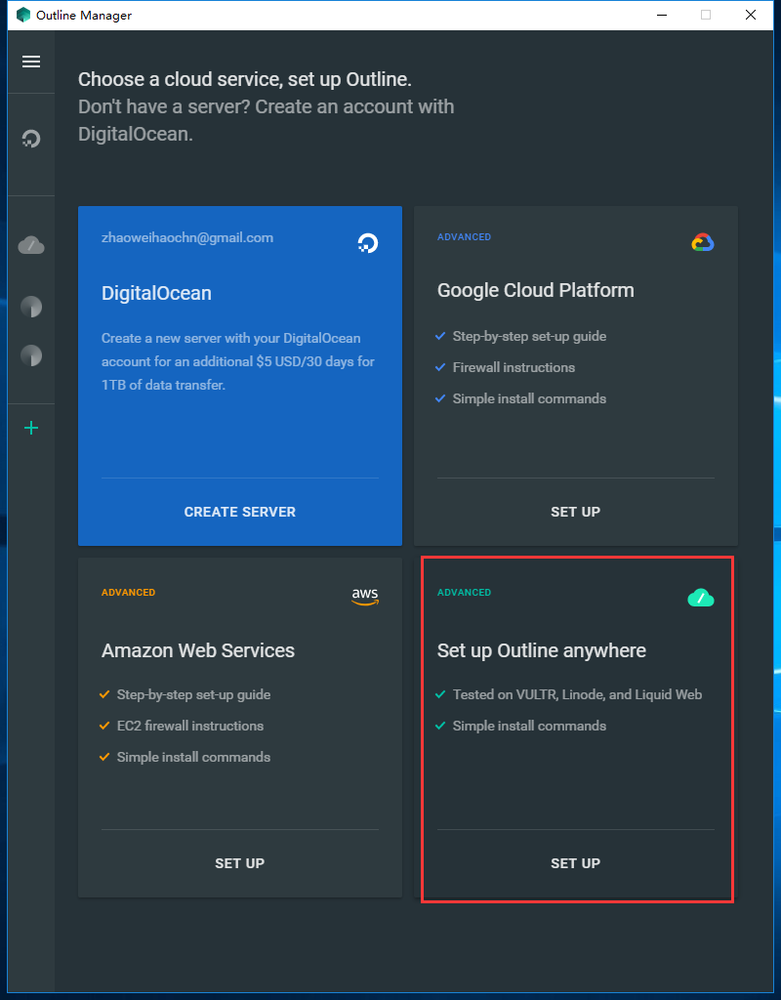
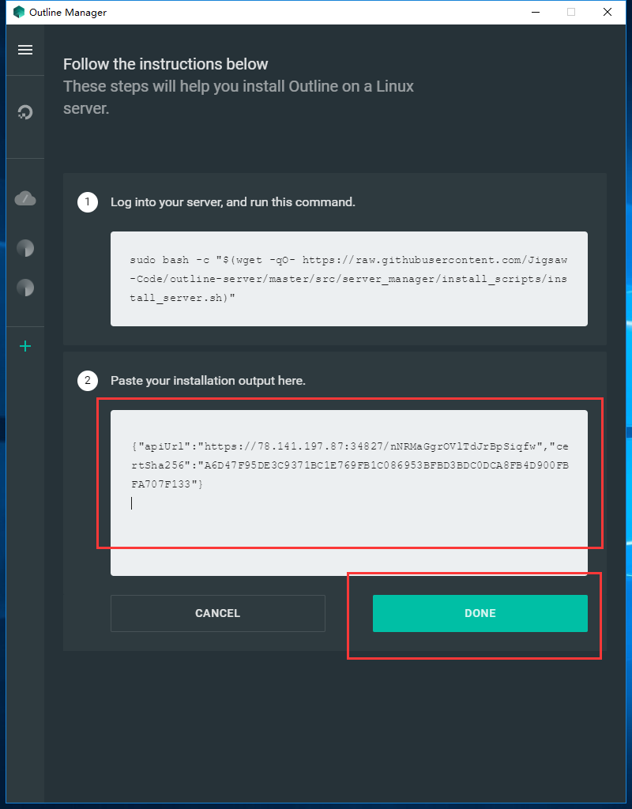
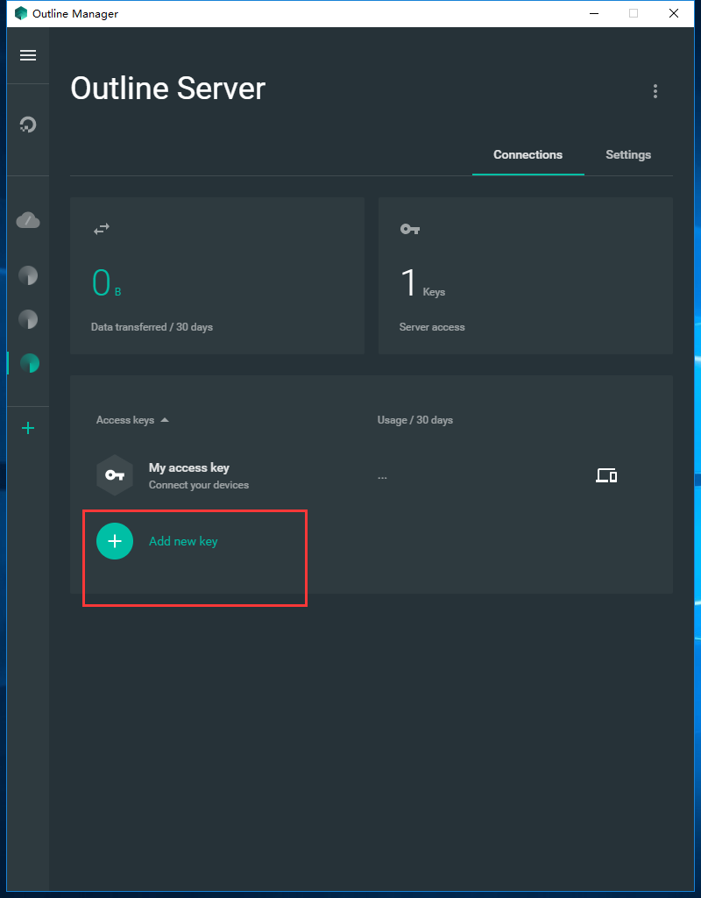
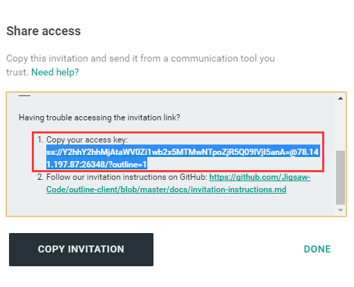
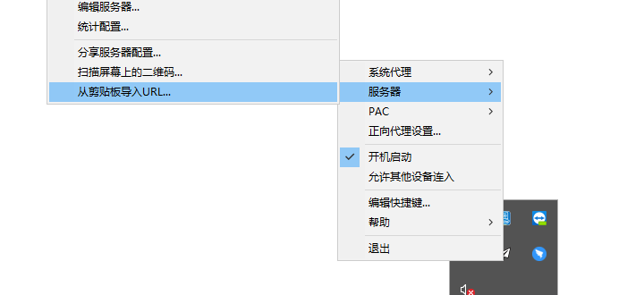
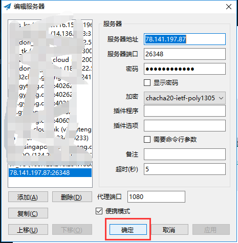

# 给小白的超简单shadowsocks翻墙教程(备用教程)

# 问题

❓如果对文章有任何疑问可以提到:https://github.com/zhaoweih/Shadowsocks-Tutorial/issues

# 前言

  由于秋水逸冰大佬的退出，所以旧教程使用的一键安装shadowsocks脚本可能在未来的某一天也不管用了。出于这个原因，我又写了一篇文章用来给大家作为备用教程，这篇文章使用的是[Google Jigsaw](https://jigsaw.google.com/)团队制作的同样也是shadowsocks的一键脚本，由于是Google制作，所以迫于某些压力退出的可能性不大，个人认为可以作为长期的备用教程。

# 开始

## 购买VPS服务器

俗话说，万事起头难。想想倒也是这样，也不是说购买VPS服务器有多难，是接受它比较难，我当时也是一个还没买过服务器的小白，对于第一次尝试的东西都没有底，怎么敢随意下手。好了，你现在可以放心了，据我使用，Vultr和DigitalOcean这两个服务商都是可以随时部署随时摧毁服务器，是按每小时计费的，一个月是5美金，大概0.007美金一小时，就算你创建一个服务器IP刚好是被某墙屏蔽了，那就删掉也只是扣0.1美金，作为一个穷学生的我都能接受了，你还犹豫吗？

### 1、注册并登录

Vultr推荐链接：https://www.vultr.com/?ref=7370522

这里我比较推荐Vultr，为什么呢？因为他有日本服务器，延迟低，掉包也低；注册登录后先充值5美金，用paypal绑定国内银行卡可以最低充值5美金，当然也有支付宝，支付宝要最低10美金。


### 2、部署服务器

第一步：在个人页面点击Products然后再点右面的➕号按钮添加一个服务器


选择**Cloud Compute**


选择**Regular Performance**


第二步：在打开的页面选择德国Frankfurt服务器 (由于日本服务器滥用导致很多IP被封了，可以选择欧洲服务器，例如法国、德国等) ，如果喜欢其他服务器也可以选择，后续操作是一样一样的


第三步：接下来要注意了，系统最好选择**CentOS 7 x64**，点击CentOS可以下拉选择7 x64


第四步：选择套餐，当然ss不需要配置太高的服务器，最低配置5美金一个月的就可以了，反正我每次看2.5美金都是卖光的，如果你能看到那赶紧选啊，千年一遇。


第五步：接着就是部署起来了，当然你也可以给服务器起个名字再部署


第六步：接着等待服务器启动完成，看到Status是绿色的Running就是启动完成了，这个过程大概需要1-3分钟。


第七步：复制IP地址和密码，后面有用



第八步：启动完成后，当然测试一下有没有被封掉IP了，打开命令管理器或者终端，输入 ping+你的IP地址(对应上图的IP Address)，例如我服务器IP是78.141.197.87，则ping 78.141.197.87，如果出现下图的返回信息则这个IP是可以用的，偶尔一个request timeout也是可以的，是掉包现象，如果出现一直request timeout就把这服务器删掉重新部署吧。


好了，到此为止最困难的事情已经过去了，后面都是一键式的了，喝杯茶🍵再继续。

## 在服务器安装ss

因为我是用mac的，考虑到大多数人还是使用windows为主，我就把我的旧电脑给翻出来开机继续做教程。基于windows 7。

- **如果你是用mac，那恭喜你，下面连接的步骤直接打开终端输入**

`ssh root@你的服务器IP地址`

**连接就可以，然后可以跳过安装并运行xshell这个步骤**


- **如果你是用windows10,可以打开系统自带的powershell工具:**


**输入**

`ssh root@你的服务器IP地址`


**连接就可以（注意密码粘贴需要使用鼠标右键），然后可以跳过安装并运行xshell这个步骤**

### 安装并运行xshell

**提示：如果服务器可以ping通，但xshell无法连接说明服务器被封端口了（很多vultr日本服务器有这种状况），请更换其他地区服务器或者更换服务器商**

windows下ssh连接需要下载Xshell，百度搜一搜就能下载了，当然你也可以用其他的，这里以Xshell为例，安装好Xshell后点击文件-新建


接下来配置连接,名称随便起，主机填写你的服务器IP地址，下面都默认就好


接下来在弹出的窗口填root（默认服务器用户名）


这里就要填入你在上篇复制的服务器密码了


### 安装ss

上面登录成功后如图所示


下面就是整个教程最重要的部分了，感谢Google团队制作的outline（制作的初衷是为了让记者更安全发布新闻的，由于同样使用shadowsocks，所以可以用于翻墙）。

``` bash
sudo bash -c "$(wget -qO- https://raw.githubusercontent.com/Jigsaw-Code/outline-server/master/src/server_manager/install_scripts/install_server.sh)"
```

复制粘贴上面代码到xshell，在xshell要右键粘贴，然后敲回车键，然后就会有一串不知名代码蹦出，停在这里了，这里的意思是问你是否需要安装Docker，输入y回车就行。



这里可能需要等待一会，看到下图就是大功告成了。干杯🍻！复制绿色的那段代码保存起来，后面会用到！



接下来还需要执行下面两条命令关闭CentOS 7自带的防火墙

```bash
systemctl stop firewalld

systemctl disable firewalld
```


## 下载服务端管理器

windows版：https://raw.githubusercontent.com/Jigsaw-Code/outline-releases/master/manager/stable/Outline-Manager.exe

mac版：https://raw.githubusercontent.com/Jigsaw-Code/outline-releases/master/manager/stable/Outline-Manager.dmg

Linux版：https://raw.githubusercontent.com/Jigsaw-Code/outline-releases/master/manager/stable/Outline-Manager.AppImage

这里以windows为例，下载后安装完成后选择第四个 set up outline anywhere



将上面保存的绿色代码粘贴到第二个输入框内，然后选择done



添加完服务器后选择加号(Add new key)，添加一个key



名字可以随便起，例如我是在家里用的，叫home，接着点击右方的分享按钮


最后找到copy access key，复制保存蓝色选择部分



## 下载客户端

虽然outline有很多平台的客户端，但是不建议使用outline作为客户端，因为没有pac功能，导致所有流量都会经过服务器，上国内网站会比较慢。客户端推荐使用shadowsocks官方客户端。

下面是各个终端的下载地址（我用过Windows,MAC,Android,IOS操作起来都是差不多的。）：

Windows：https://github.com/shadowsocks/shadowsocks-windows/releases

Android:https://github.com/shadowsocks/shadowsocks-android/releases

MAC:https://github.com/shadowsocks/ShadowsocksX-NG/releases

Linux:https://github.com/shadowsocks/shadowsocks-qt5/wiki/Installation

IOS: 

由于国区APP下架VPN类APP，包括支持ss类的APP，所以需要切换账号

建议注册一个国外账号，不要国内账号换区，这样既可以需要下载国内APP时切换国区账号，需要下载国外APP时切换外区账号。

**建议不想折腾的可以淘宝买一个国外App Store账号，便宜方便快捷**

步骤：

1.获取一个国区以外的账号

注册国外appid教程：https://www.zhihu.com/question/26458172

（相关注册外区账号教程很多，可以自行搜索）

**由于苹果的新政策，注册apple id在付款方式选择的时候非当地ip无法选择none选项，例如我注册英国区账号，需要ip为英国才可以。即在注册时要搭梯子，对应ip注册。**

2.在APPStore中切换为国区以外账号

3.在AppStore搜索**Potatso Lite**安装

注：或者其他支持shadowsocks的APP也可以，这里比较推荐Potatso Lite
- [Potatso Lite](https://itunes.apple.com/us/app/potatso-lite/id1239860606?mt=8)

下面以windows为例演示：

安装完成后打开应用  

确保你已经复制了上文蓝色部分内容，然后右击小飞机，选择服务器-从剪贴板导入URL



接着点击确定



最后确保打开了PAC模式


- 这里简要说一下PAC模式和全局模式问题：

PAC模式就是访问国内网站会走国内IP，访问被封的网站走服务器IP

全局就是全部走服务器IP

这里建议选择PAC模式，PAC的地址都是保存在[gfwlist](https://github.com/gfwlist/gfwlist)

希望大家遇到PAC无法访问的网站多上去提issues。

### 神圣时刻

接着最神圣的时刻来了，在浏览器输入google.com，回车，蹦，谷歌回来了


### 补充：

关于CentOS关闭防火墙操作详细介绍可以查看下面ChatGPT的答复:

在CentOS中关闭防火墙可以按照以下步骤进行操作：

1. 使用root用户登录到CentOS系统。
2. 检查防火墙状态。在命令行界面输入以下命令：

```bash
systemctl status firewalld
```

如果防火墙已经启动，命令行会显示防火墙的状态为“active”。

1. 关闭防火墙。在命令行界面输入以下命令：

```bash
systemctl stop firewalld
```

该命令将停止防火墙服务。

1. 禁止防火墙在开机时自动启动。在命令行界面输入以下命令：

```bash
systemctl disable firewalld
```

该命令将禁止防火墙在开机时自动启动。

1. 检查防火墙状态。在命令行界面输入以下命令：

```bash
systemctl status firewalld
```

如果防火墙已经关闭，命令行会显示防火墙的状态为“inactive”。

需要注意的是，关闭防火墙会增加系统的风险，可能会导致系统受到攻击或入侵。因此，在关闭防火墙之前，请确保已经采取其他安全措施，例如使用其他防火墙或限制网络访问等。


感谢ChatGPT的解答！

# 讨论
## Discord
**我创建了一个discord聊天室，遇到问题的小伙伴可以一起讨论**
[](https://discord.gg/wHFxCVk)

# 建议

如果大家对这篇文章有任何疑问都可以提[issues](https://github.com/zhaoweih/Shadowsocks-Tutorial/issues)，如果你有其他更简单或者其他方法翻墙也可以pull requests。

# 关于

我是一名初入社会的社畜，一个追求自由的少年，如果想要找我，可以给我发邮件📧

📮我的邮箱：zhaoweihao.dev@gmail.com

# 赞赏

我目前生活还是蛮自如的，有吃的有喝的，就不用赞赏了。喜欢就给我个star或者fork一下吧❤️，谢谢！
