# 给小白的V2ray教程

# 前言

可能接近敏感日子，最近小飞机（shadowsocks）大面积坠机，我有几个服务器也挂了，所以转到v2ray去了，用了几天还蛮稳定的，出篇教程给各位度过一下敏感的日子。

# 开始

## 购买VPS服务器

俗话说，万事起头难。想想倒也是这样，也不是说购买VPS服务器有多难，是接受它比较难，我当时也是一个还没买过服务器的小白，对于第一次尝试的东西都没有底，怎么敢随意下手。好了，你现在可以放心了，据我使用，Vultr和DigitalOcean这两个服务商都是可以随时部署随时摧毁服务器，是按每小时计费的，一个月是5美金，大概0.007美金一小时，就算你创建一个服务器IP刚好是被某墙屏蔽了，那就删掉也只是扣0.1美金，作为一个穷学生的我都能接受了，你还犹豫吗？

### 1、注册并登录

Vultr推荐链接：https://www.vultr.com/?ref=7370522

这里我比较推荐Vultr，为什么呢？因为他有日本服务器，延迟低，掉包也低；注册登录后先充值5美金，用paypal绑定国内银行卡可以最低充值5美金，当然也有支付宝，支付宝要最低10美金。


### 2、部署服务器

第一步：在个人页面点击Products然后再点右面的➕号按钮添加一个服务器


第二步：在打开的页面选择美国Los Angeles服务器 ，如果喜欢其他服务器也可以选择，后续操作是一样一样的

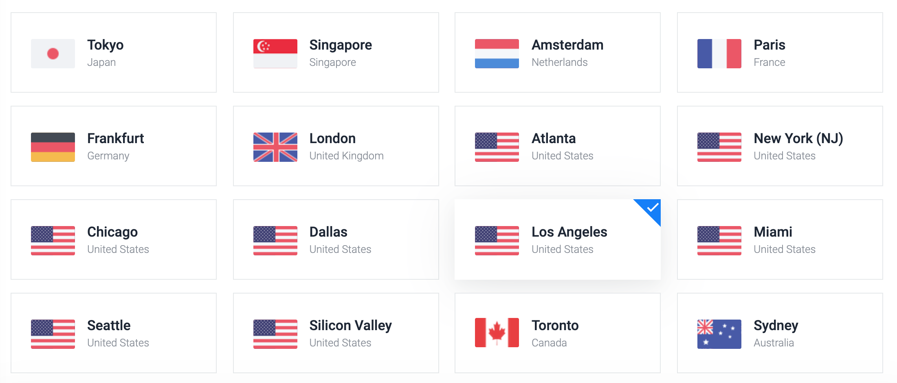

第三步：接下来要注意了，系统最好选择Debian 10，点击Debian可以下拉选择10 x64

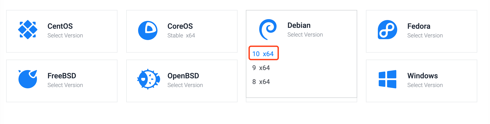

第四步：选择套餐，当然ss不需要配置太高的服务器，最低配置5美金一个月的就可以了，反正我每次看2.5美金都是卖光的，如果你能看到那赶紧选啊，千年一遇。


第五步：接着就是部署起来了，当然你也可以给服务器起个名字再部署


第六步：接着等待服务器启动完成，看到Status是绿色的Running就是启动完成了，这个过程大概需要1-3分钟。


第七步：复制IP地址和密码，后面有用

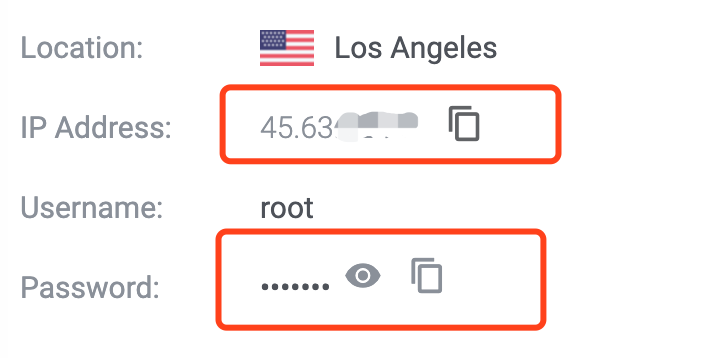

第八步：启动完成后，当然测试一下有没有被封掉IP了，打开命令管理器或者终端，输入 ping+你的IP地址，例如我服务器IP是8.8.8.8，则ping 8.8.8.8，如果出现下图的返回信息则这个IP是可以用的，偶尔一个request timeout也是可以的，是掉包现象，如果出现一直request timeout就把这服务器删掉重新部署吧。


好了，到此为止最困难的事情已经过去了，后面都是一键式的了，喝杯茶🍵再继续。

## 在服务器安装v2ray

因为我是用mac的，考虑到大多数人还是使用windows为主，我就把我的旧电脑给翻出来开机继续做教程。基于windows 7。

- **如果你是用mac，那恭喜你，下面连接的步骤直接打开终端输入**

`ssh root@你的服务器IP地址`

**连接就可以，然后可以跳过安装并运行xshell这个步骤**


- **如果你是用windows10,可以打开系统自带的powershell工具:**


**输入**

`ssh root@你的服务器IP地址`


**连接就可以，然后可以跳过安装并运行xshell这个步骤**

### 安装并运行xshell

**提示：如果服务器可以ping通，但xshell无法连接说明服务器被封端口了（很多vultr日本服务器有这种状况），请更换其他地区服务器或者更换服务器商**

windows下ssh连接需要下载Xshell，百度搜一搜就能下载了，当然你也可以用其他的，这里以Xshell为例，安装好Xshell后点击文件-新建


接下来配置连接,名称随便起，主机填写你的服务器IP地址，下面都默认就好


接下来在弹出的窗口填root（默认服务器用户名）


这里就要填入你在上篇复制的服务器密码了


### 安装v2ray

上面登录成功后如图所示


接下来就是精髓部分了

```bash
bash <(curl -s -L https://git.io/v2ray.sh)
```

复制粘贴上面代码到xshell，在xshell要右键粘贴，然后就会有一大串不知名代码蹦出，停在这里了

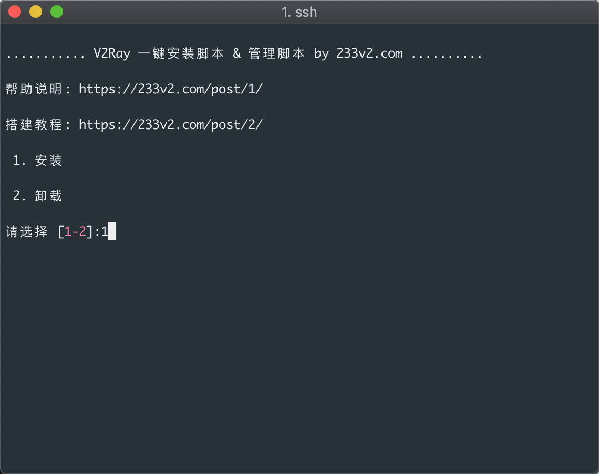

输入1回车 安装

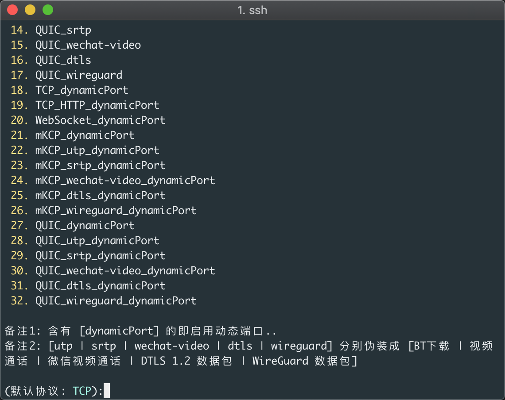

接下来选择协议，这里默认TCP就可以，直接回车

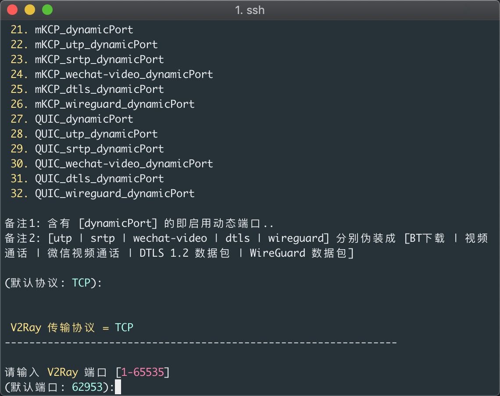

端口用默认就行，直接回车

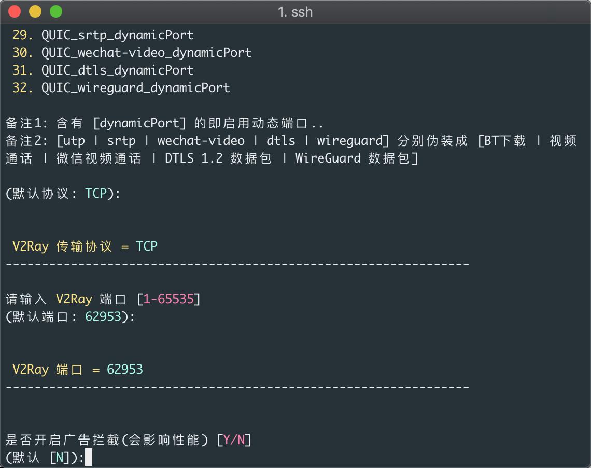

广告拦截不需要了，直接回车就行

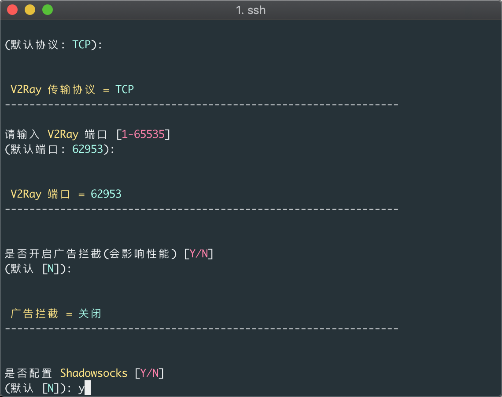

到了是否配置ss部分，按你需要吧，这里我们选择需要配置，输入y回车

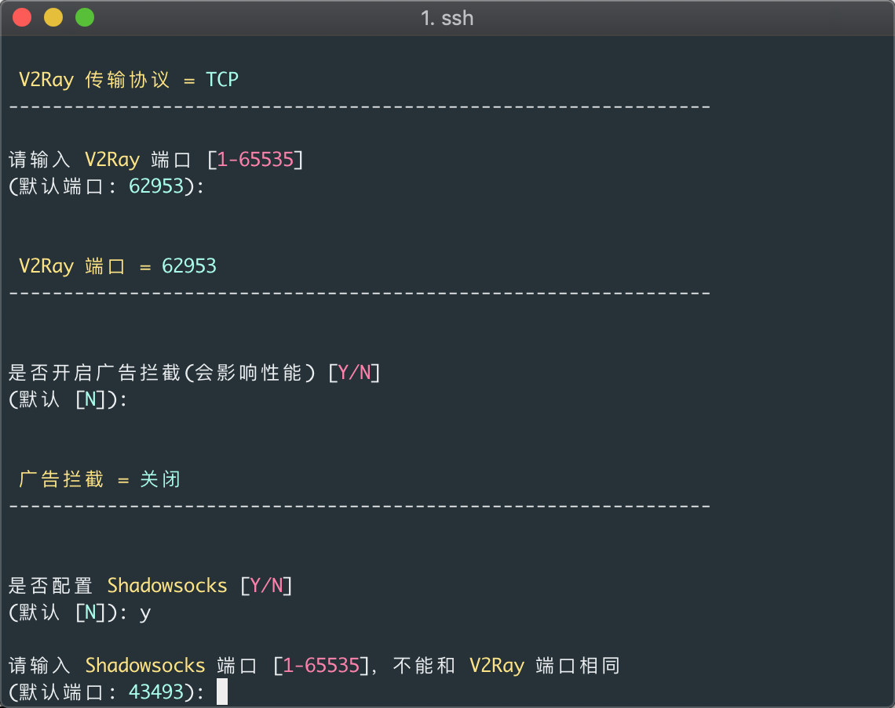

设置ss端口，直接回车就行

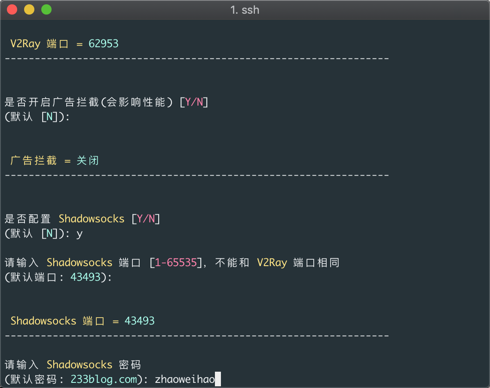

设置ss密码，输入自己喜欢的密码后回车就行

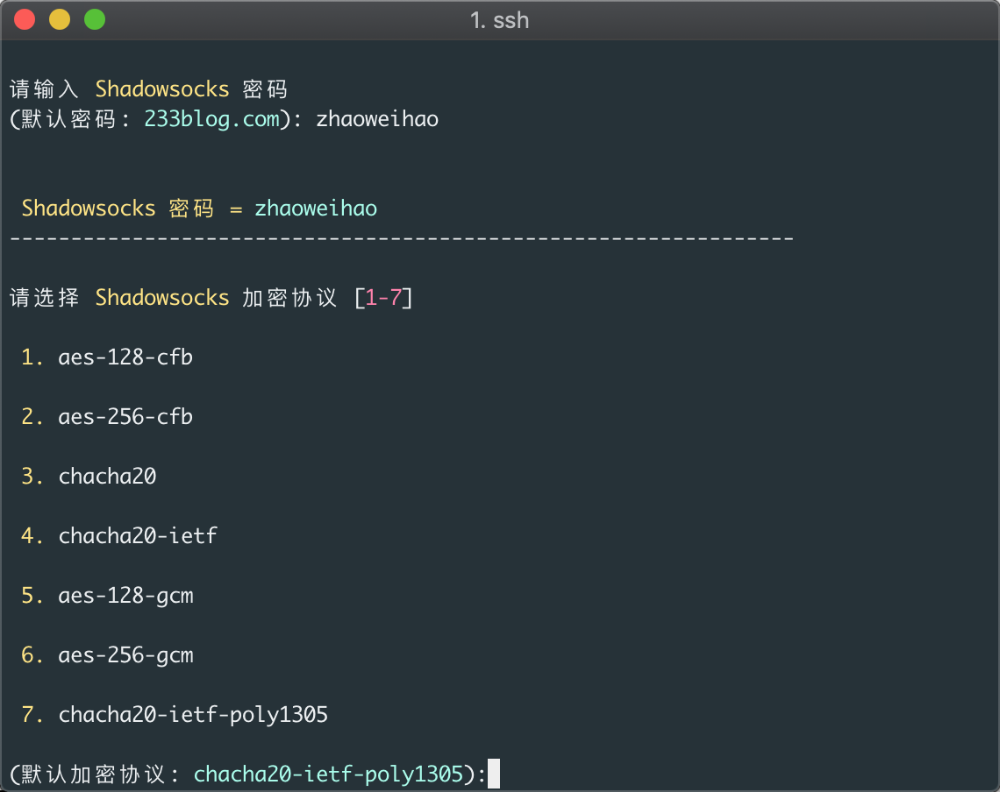

加密协议默认就行，直接回车

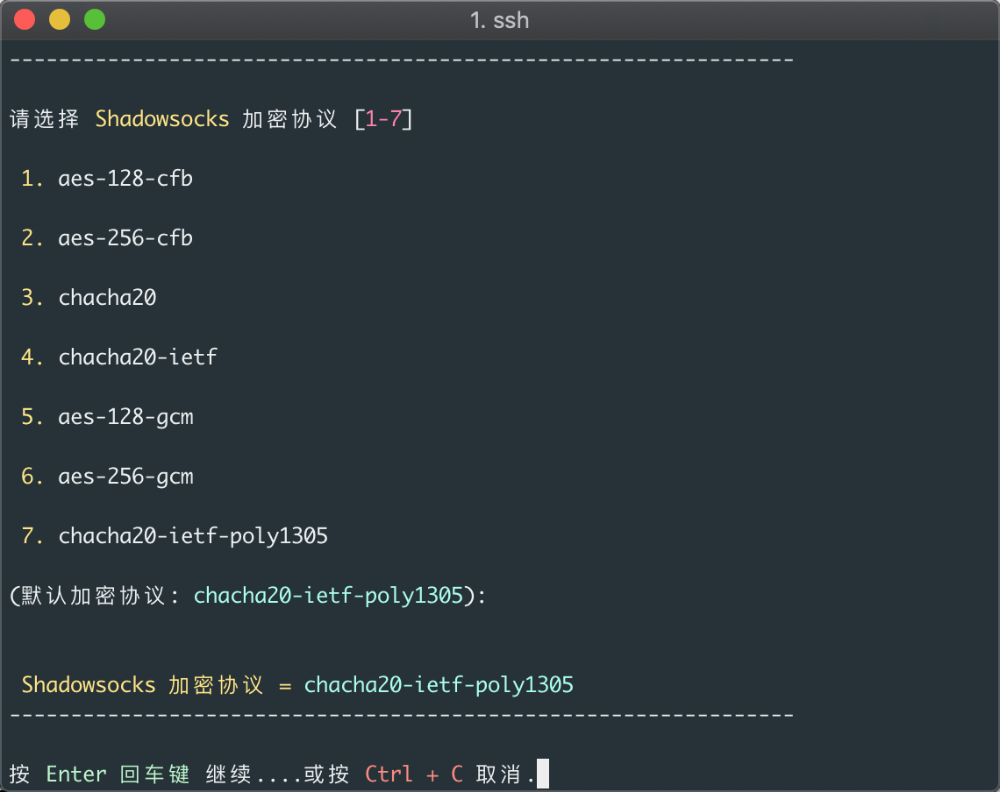

再按回车确认继续


确认一下自己的信息没有问题回车继续就行

接下来就等待一会脚本安装即可

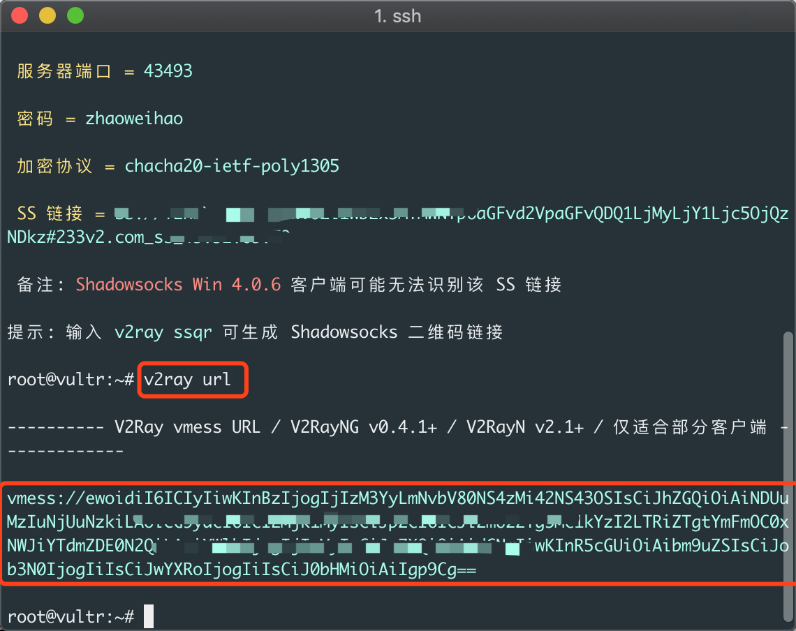

安装完成后就可以输入v2ray url拿到加密的v2ray配置信息,格式是vmess://开头的，复制到剪贴板后面有用

### 安装v2ray客户端

因为我只有 macbook和iphone,所以客户端这块只能安装mac端和ios端，其他端例如windows和android可以去谷歌搜索，步骤都是差不多的。

V2ray客户端下载：

Mac端：https://github.com/yanue/V2rayU/releases/latest

IOS端：Kitsunebi(需要国外苹果账号，可以在淘宝买共享账号)

Windows端:https://github.com/2dust/v2rayN/releases/latest

Android端:https://github.com/2dust/v2rayNG/releases/latest

WIndows端教程：[V2RayN使用教程](https://github.com/233boy/v2ray/wiki/V2RayN%E4%BD%BF%E7%94%A8%E6%95%99%E7%A8%8B)


以下我以mac端为例：

打开后选择V2rayU.dmg下载安装

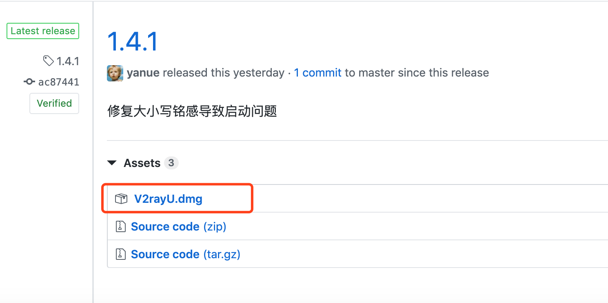

记得之前复制的加密的配置信息吗，安装打开V2rayU后选择从粘贴板导入就行,然后重新打开一下V2rayU就可以打开谷歌了

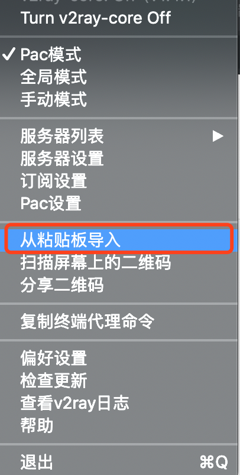

# 关于

我是一名普通的大学学生，一个追求自由的少年，如果想要找我，可以给我发邮件📧

📮我的邮箱：zhaoweihao.dev@gmail.com


# 赞赏

作为学生我目前生活还是蛮自如的，有吃的有喝的，就不用赞赏了。喜欢就给我个star或者fork一下吧❤️，谢谢！